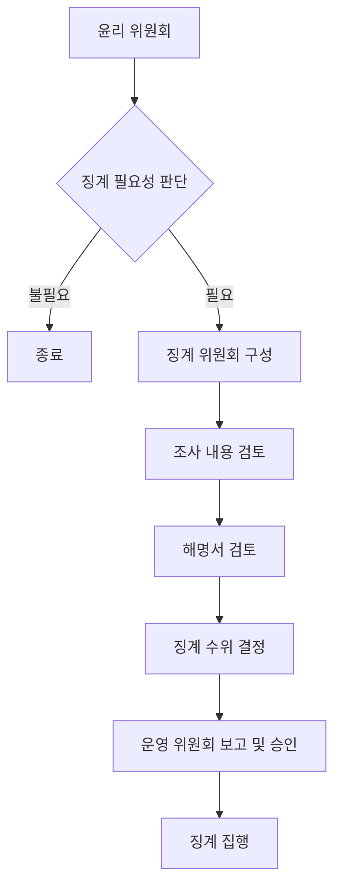

# 민주 서울 네트워크 위원회

## 상설 위원회

### 활동 규칙 제개정 위원회

#### 목적

1. 민서네의 활동 규칙을 `제정하고 개정`하는 역할을 수행한다.

#### 구성

1. 상설 위원회의 일반적인 구성 원칙을 따른다.

#### 역할

1. 활동 규칙의 제정 및 개정안을 작성한다.
2. 제정 및 개정안에 대한 의견 수렴 과정을 진행한다.
3. 최종 제정 및 개정안을 운영 위원회에 보고한다.
4. 활동 규칙 제개정시, 규칙의 적용과 해석을 위한 `의도 및 해설집`을 제공하여 활동 규칙을 잘 활용할 수 있도록 한다.

#### 특이사항

1. 활동 규칙 개정 시 민서네 전체 위원들의 의견을 수렴하는 절차를 반드시 거쳐야 한다.

### 윤리 위원회

#### 목적

1. 민서네 전체 위원들의 윤리적 행동을 감독/교육하고, `징계 필요성`을 최대한 객관적으로 판단한다.

#### 구성

1. 민서네 위원장을 윤리 위원회의 장으로 정한다.
2. 기타 구성원은 상설 위원회의 일반적인 구성 원칙을 따른다.

#### 역할

1. 신고된 사안에 대해 성실히 조사하여 징계 필요성 여부를 판단한다.
2. 징계 필요성 여부는 신고 후 1주 내로 결정해야 한다.
3. 운영 위원회의 최종 결정 전, 당사자는 운영 위원회에 참석하여 항변할 기회를 가질 수 있다.
4. 윤리 위원회는 징계의 필요성만을 결정하며, 구체적인 징계 수위는 결정하지 않는다.
5. 징계가 필요하다고 결졍된 경우, 조사 내용을 징계 당사자에게 전달하고 해명서를 요청한다.
6. 조사 내용을 정리하여 운영 위원회에 보고하며, 징계가 필요한 경우 위원장에게 징계를 담당할 위원회의 구성을 건의한다.

#### 징계 필요성 여부

1. 민서네, 더불어민주당, 더불어민주당 서울시당의 명예를 훼손한 경우. (민서네 위원 사인간에 발생한 명예훼손의 경우는 제외한다.)
2. 민서네의 직위를 남용하거나 사칭한 경우
3. 그 밖에 민서네 자격을 박탈할 만큼 중대한 위반 행위를 한 경우

### 활동 지원 위원회

#### 목적

1. 민서네 위원들의 제안서 작성부터 운영 위원의 기획서 작성 및 실행까지 전 과정을 전문적으로 `지원`한다.

#### 구성

1. 상설 위원회의 일반적인 구성 원칙을 따른다.

#### 제안서 단계 지원

1. 민서네 위원의 제안서 작성을 지원한다.
2. 제안에 대한 실행 가능성 등에 대해 조언을 제공한다.

#### 기획서 단계 지원

1. 운영 위원의 기획서 작성을 지원한다.
2. 기획에 대한 실행 가능성 등에 대해 조언을 제공한다.
3. 기획 실행에 필요한 예상 예산을 산정하는 데 도움을 준다.

#### 실행 단계 지원

1. 장소 섭외 등 실무적 지원을 제공한다.
2. 서울시당과의 협업이 필요한 경우 카운터파트로 업무를 진행한다.

#### 제안서

1. 민서네 위원 누구나 자유롭게 제출할 수 있다.
2. 활동에 대한 기본적인 아이디어와 개요를 담고 있다.
3. 제안서 양식은 간단하며, 활동의 목적, 예상 효과, 필요한 자원 등을 포함하는 형태로, 활동 지원 위원회에서 만들어 제공한다.

#### 기획서

1. 1명 이상의 운영 위원이 제출해야 한다.
2. 제안서를 바탕으로 구체화된 실행 계획을 담고 있어야 한다.
3. 기획서 양식은 상세한 일정, 필요 인원, 예상 예산, 기대 효과 등을 포함하는 형태로, 활동 지원 위원회에서 만들어 제공한다.
4. 운영 위원회의 승인을 받아야 실행될 수 있다.

### 공론화 위원회

#### 목적

1. 민서네 전체의 의견을 수렴하기 위한 `공론의 장`을 마련하고, 중요 쟁점에 대한 토론을 주관한다.

#### 구성

1. 상설 위원회의 일반적인 구성 원칙을 따른다.

#### 역할

1. 민서네 안팎에서 일어나는 중요 쟁점을 파악하고 공론화 의제를 선정한다.
2. 선정된 의제에 대한 공론화 과정을 설계하고 진행한다.
3. 공론화 과정에서 다양한 의견이 공정하게 표현될 수 있도록 토론을 조율한다.
4. 공론화 결과를 정리하고 운영 위원회에 보고한다.
5. 필요시 외부 전문가를 초청하여 의견을 청취하고 토론에 참여시킨다.

#### 특이사항

1. 모든 민서네 위원은 공론화 위원회에 의제를 제안할 수 있다.
2. 공론화 과정은 온라인 또는 오프라인으로 진행될 수 있으며, 가능한 많은 민서네 위원들의 참여를 독려한다.
3. 공론화 결과는 구속력은 없지만, 운영 위원회의 의사결정에 중요한 참고자료로 활용될 수 있다.

## 준상설 위원회

### 징계 위원회

#### 목적

1. `징계의 수위를 결정`하기 위하여 필요시에만 존재하는 준상설 위원회이다.

#### 구성

1. 윤리 위원회에서 징계의 필요성을 판단하고 위원장에게 요청하면, 위원장은 3일 이내에 징계 위원회 소집 공고를 내야 한다.
2. 소집 공고 후 3일간 참여 희망 운영 위원 및 민서네 위원들을 모집하여 징계 위원회를 구성한다.
3. 구성원 수는 민서네 전체 인원의 3% 이상으로 한다.
4. 공정성 보장을 위해 윤리 위원회 위원은 징계 위원회 구성에서 제외한다.
5. 해당 사안의 처리가 완료되면 자동으로 해산된다.

#### 역할

1. 윤리 위원회가 제출한 징계 필요성 판단 및 조사 내용을 검토한다.
2. 징계 당사자의 해명서를 검토한다.
3. 해당 사안에 대한 징계 수위를 결정한다. 필요시 징계를 내리지 않을 수도 있다.
4. 결정된 징계 내용을 운영 위원회에 보고한다.

#### 운영

1. 징계 위원회는 구성 완료 즉시 활동을 시작하며, 1주일 이내에 결론을 도출한다.
2. 윤리 위원회의 조사 내용과 징계 당사자의 해명서를 근거로 판단한다.
3. 징계 당사자가 해명서를 제출하지 않을 경우, 해당 혐의를 인정한 것으로 간주한다.
4. 징계 위원회의 결정은 운영 위원회에 보고되며, 운영 위원회의 최종 승인 후 징계가 집행된다.

#### 특이사항

1. 운영 위원회는 징계 위원회의 결정을 존중하나, 필요시 징계 수위를 조정할 수 있다.
