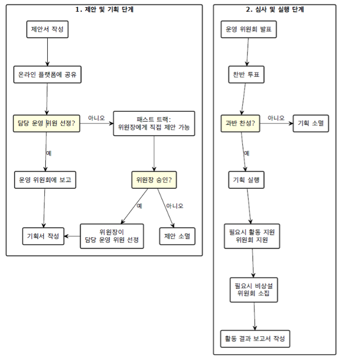
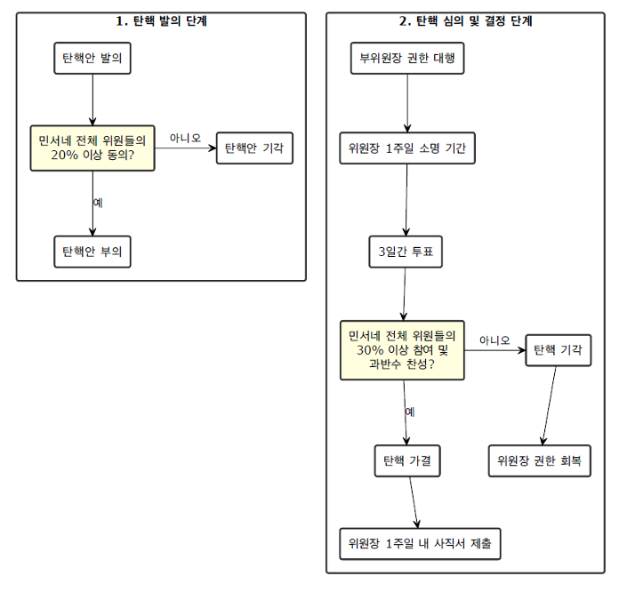
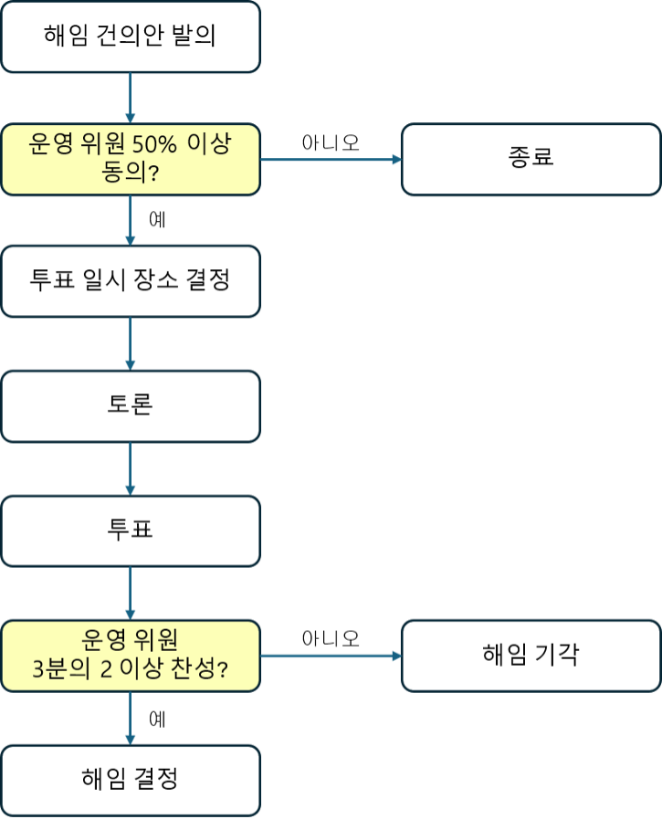

# 민서네 운영 지침 및 절차서

## 1. 활동 제안 및 실행 절차

### 1.1 제안 절차

1. 민서네 위원은 누구나 활동 기획을 제안할 수 있다.
2. 활동기획의 제안은 활동기획제안서(이하 제안서)의 작성을 통해 실행된다.
3. 제안서 작성 시 어려움이 있는 경우, 활동지원 위원회에 도움을 요청할 수 있다.
4. 완성된 제안서를 지정된 온라인 플랫폼에 게시하여 제출한다.

### 1.2 담당 운영 위원 선정

1. 제안자는 온라인 플랫폼을 통해 자신의 제안 내용을 알리고, 해당 제안을 책임감 있게 주도할 운영 위원을 직접 찾아야 한다.
2. 담당 운영 위원이 확정되면, 제안서가 게시된 온라인 플랫폼의 댓글 등을 통해 이를 공지해야 한다.

### 1.3 운영 위원의 역할

1. 담당 운영 위원은 해당 제안에 대한 책임을 맡게 된 사실을 운영 위원회에 보고해야 한다.
2. 운영 위원은 제안자와의 심도 있는 논의를 통해 보다 구체적이고 실행 가능한 기획서를 작성해야 한다.
3. 기획서 작성 단계에서 공론화 위원회에 토론을 제안하거나 활동 지원 위원회에 절차적 자문을 구할 수 있다.

### 1.4 기획안 승인 절차

1. 완성된 기획안은 운영 위원회에서의 찬반 투표에 앞서 발표를 통해 활동의 목적 및 예상 성과 등을 공유해야 한다.
2. 발표 이후 반대 의견에 대한 충분한 청취 과정을 거친다.
3. 활동 제안자는 활동 담장 위원을 지원하기 위하여 운영 위원회에 참여할 수 있다.
4. 과반수의 찬성을 얻은 기획은 계획대로 진행되며, 그렇지 않은 경우 해당 기획은 폐기된다.
5. 기획이 무산될 경우, 반대 의견을 체계적으로 정리하여 민서네 전체 위원에게 공지해야 한다. 이때 의견 제시자의 익명성은 엄격히 보장되어야 한다.

## 1.5 승인된 기획의 실행

1. 필요 시 민서네 위원장에게 비상설 위원회 소집을 공식적으로 요청할 수 있다.
2. 활동 지원 위원회에 전문적인 지원과 조언을 요청할 수 있다.

## 1.6 패스트 트랙 제안

1. 민서네 위원이 담당 운영 위원을 찾지 못한 경우, 민서네 위원장에게 직접 제안할 수 있다.
2. 민서네 위원장은 제안 내용을 검토 후 진행 여부를 결정한다.
3. 진행이 결정된 경우, 민서네 위원장의 재량으로 적합한 담당 운영 위원을 선정할 수 있다.

## 1.7 패스트 트랙 운영 위원 선정 방식

1. 운영 위원 선발 시, 민서네 위원장이 임의의 방식으로 담당 순번을 미리 선정한다.
2. 패스트 트랙을 통해 결정된 제안 또는 기획의 담당 운영 위원을 민서네 위원장이 순번에 따라 배정한다.
3. 운영 위원이 하나의 제안 또는 기획을 담당하게 되면, 형평성을 유지하기 위해 그 운영 위원은 자동으로 순번이 마지막으로 이동된다.

## 1.8 운영 위원의 의무

1. 운영 위원은 자신이 맡은 제안/기획 업무가 승인처리 될 수 있도록 전문성과 열정을 바탕으로 최선을 다해야 한다.
2. 운영 위원은 자신이 맡은 제안/기획 업무가 성공적으로 완료될 수 있도록 전문성과 열정을 바탕으로 최선을 다해야 한다.

<figure>
  
  <figcaption>그림1. 활동 제안과 실행 절차 흐름도</figcaption>
</figure>

## 2. 대외활동 규정 및 절차

### 2.1 정의

민서네의 공식 명의로 문서를 발행하거나 민서네를 대표하여 수행하는 모든 활동을 대외 활동으로 규정한다.

### 2.2 승인 절차

1. 대외 활동 역시 기존의 활동 제안 및 실행 절차를 따른다.
2. 기획서 작성 단계에서 반드시 공론화 위원회를 통해 민서네 전체 위원들의 다양한 의견을 수렴하고 이를 반영해야 한다.
3. 운영 위원회에서 가결된 대외 활동 안건은 최종적으로 민서네 전체 위원들의 투표를 거쳐 결정한다.
4. 민서네 전체 위원들의 투표는 민서네의 공식 온라인 플랫폼을 통해 진행한다.
5. 민서네 전체 위원들의 투표 기간은 원칙적으로 3일로 설정하나, 민서네 위원장의 판단에 따라 조정할 수 있다.

### 2.3 승인 기준

1. 대외 활동의 승인은 민서네 전체 위원의 30% 이상이 투표에 참여하고, 투표 참여 인원의 과반수 이상의 찬성을 얻어야 최종승인 된다.
2. 투표 참여율이 민서네 전체 위원의 30% 미만인 경우, 해당 안건은 무효로 처리된다.

### 2.4 신속처리 절차

1. 신속한 대외 활동이 요구되는 긴급 상황에서는 민서네 위원장이 운영 위원회의 동의를 얻어 임시 성명서를 발표하거나 긴급 대응 활동을 수행할 수 있다.
2. 이 경우, 공론화 위원회와 민서네 전체 위원들의 투표도 생략할 수 있다.

## 3. 민서네 위원장의 탄핵 및 사임 절차

### 3.1 탄핵 사유

1. 중대한 명예훼손 : 민서네의 공적 이미지와 신뢰도를 현저히 저해하는 언행을 한 경우
2. 직무 유기 : 합당한 사유 없이 회의를 지속적으로 연기하거나 불참하는 행위, 또는 회의록 작성을 소홀히 하는 등직무를 성실히 수행하지 않는 경우
3. 정보관리의 부실 : 민서네 전체 위원들의 개인정보를 부주의하게 관리하여 유출 사고를 초래한 경우

### 3.2 탄핵안의 발의 및 상정

1. 운영 위원 또는 민서네 위원은 온라인 플랫폼을 통해 탄핵안을 발의할 수 있다.
2. 운영 위원이 발의한 탄핵안은 민서네 전체 위원의 20% 이상이 동의하면 상정된다.
3. 민서네 위원은 민서네 전체 위원의 10% 이상이 서명한 탄핵안을 제출하여 발의할 수 있고, 제출과 동시에 탄핵안이 상정된다.
4. 탄핵안이 정식으로 상정되는 즉시, 민서네 부위원장에게 민서네 위원장의 모든 권한이 자동으로 위임된다.

### 3.3 탄핵안 상정 후 절차

1. 탄핵안이 상정된 후 1주일 동안 민서네 위원장에게 소명 기회가 주어진다.
2. 소명 기간 종료 후, 3일간 민서네 전체 위원들은 투표를 진행한다.

### 3.4 탄핵의 결정

1. 민서네 전체 위원의 30% 이상이 투표에 참여하고, 투표 참여 인원의 과반수 이상 찬성으로 탄핵이 가결된다.
2. 탄핵이 가결되면 민서네 위원장직은 공석이 된다.
3. 탄핵된 민서네 위원장은 1주일 이내에 서울시당에 공식적으로 사직서를 제출해야 한다.

### 3.5 탄핵의 기각

탄핵이 기각된 경우, 민서네 위원장은 민서네 부위원장으로부터 위임받은 모든 권한을 즉시 회복한다.

### 3.6 사임

민서네 위원장이 개인적 사유나 불가항력적 상황으로 인해 직무 수행이 불가능하다고 판단할 경우, 민서네 부위원장에게 모든 권한을 위임하고 사임할 수 있다.

<figure>
  
  <figcaption>그림2. 민서네 위원장의 탄핵절차 흐름도</figcaption>
</figure>

## 4. 신임 민서네 위원장의 선출 절차

### 4.1 민서네 위원장 직이 공석이 되면, 운영 위원회는 비상대책위원회로 전환되며, 기존의 민서네 부위원장은 비상대책 민서네 위원장으로 임명되고 운영 위원들은 그 직위를 유지한다.

### 4.2 비상대책위원회는 새로운 민서네 위원장 선출을 위한 선거를 준비하고 관리하는 임시기구로서, 선거 외의 다른 새로운 기획을 추진할 수 없으며, 현재 진행중인 활동 등이 원활히 수행될 수 있도록 관리할 책임이 있다.

### 4.3 신임 민서네 위원장의 선거는 더불어민주당 중앙당의 투표시스템을 활용하는 것을 원칙으로 하나 불가피 한 경우 민서네 공식 플랫폼의 투표시스템을 활용할 수 있다.

### 4.4 비상대책위원회가 구성되는 즉시, 1주일간의 신임 민서네 위원장의 후보를 모집하고, 이어서 1주일간 후보자 토론 및 선거운동기간 갖는다. 그리 고 3일간 투표를 진행하여 신임 민서네 위원장을 선출한다.

### 4.5 비상대책위원장이 위원장 선거에 출마하고자 할 경우, 현 운영 위원 중 1인에게 비상대책원장직을 이양해야 한다.

<figure>
  
  <figcaption>그림3. 신임 민서네 위원장의 선출 절차 흐름도</figcaption>
</figure>

## 5. 민서네 부위원장 및 운영 위원의 해임(사임) 절차

### 5.1 해임 건의안의 발의

1. 민서네 위원장과 민서네 부위원장은 운영 위원에 대한, 운영 위원은 민서네 부위원장과 다른 운영 위원에 대한 해임 건의안을 온라인 플랫폼을 통해 발의할 수 있다.
2. 민서네 위원은 민서네 부위원장, 운영 위원에 대한 해임 건의안을 온라인 플랫폼을 통해 발의할 수 있다.
3. 민서네 부위원장과 운영 위원을 겸임하는 경우, 각 직책에 대해 개별적으로 해임 건의안을 발의해야 한다.
4. 해임 건의안은 전체 운영 위원들의 과반 이상의 동의로 상정된다.
5. 해임 건의안이 상정 되더라도 해당 운영 위원의 직무수행권한은 즉시 정지되지 않는다.

### 5.2 투표 일시 및 장소 결정

1. 해임 건의안이 상정되면, 민서네 위원장이 즉시 투표 일시와 장소를 정한다.
2. 투표는 해임 건의안 상정 이후 일주일 이내에 실행되어야 한다.
3. 온라인 또는 오프라인 방식으로 진행할 수 있다.

### 5.3 투표권 위임

1. 투표권을 가진 운영 위원이 해당 투표에 참석할 수 없는 경우, 자신의 투표권을 민서네 위원장에게 위임할 수 있다.
2. 투표권 위임은 위임장을 통해 명시적으로 이루어져야 한다.
3. 투표 참여에 대한 위임일 뿐, 찬반에 대한 결정 권한은 민서네 위원장에게 있다.

### 5.4 토론 및 투표

1. 지정된 일시와 장소에서 해임 건의안에 대해 토론 후 최종 투표를 진행한다.
2. 투표 참여 인원의 ⅔ 이상이 찬성할 경우, 해당 민서네 부위원장 또는 운영 위원은 즉시 해임된다.

### 5.5 해임의 결정

해임이 결정된 민서네 부위원장 또는 운영 위원은 일주일 이내에 사직서를 서울시당에 제출한다.

### 5.6 사임

1. 사임을 원하는 민서네 부위원장 또는 운영 위원은 민서네 위원장에게 사임 의사를 밝혀야 한다.
2. 민서네 위원장은 사임 일시를 당사자와 상의하여 정하고 온라인 플랫폼에 공지한다.
3. 사임하는 민서네 부위원장 및 운영 위원은 사임 일시에 맞춰 서울시당에 사직서를 제출한다.

<figure>
  
  <figcaption>그림4. 민서네 부위원장 및 운영 위원의 해임 절차 흐름도</figcaption>
</figure>
