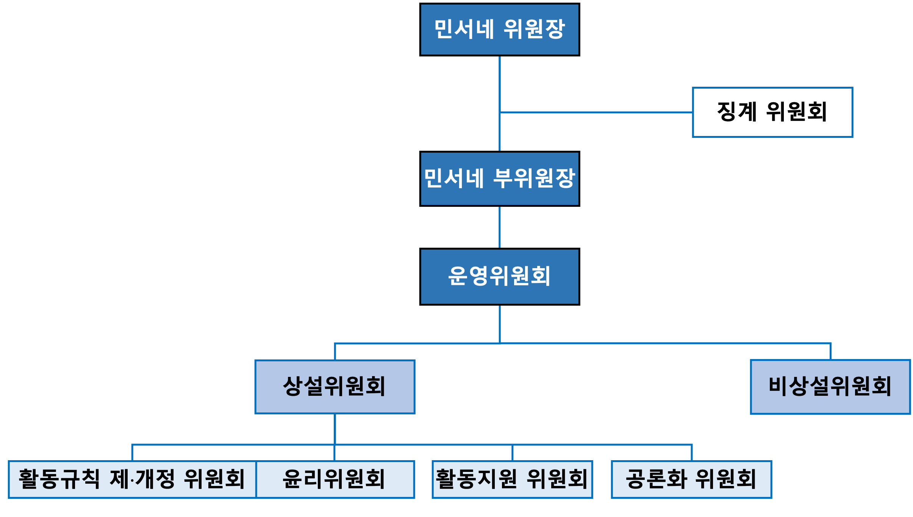

# 민주 서울 네트워크 권리당원협의체 활동 규칙

- [민주 서울 네트워크 권리당원협의체 활동 규칙](#민주-서울-네트워크-권리당원협의체-활동-규칙)
  - [1. 명칭](#1-명칭)
  - [2. 목적](#2-목적)
  - [3. 행동 규칙](#3-행동-규칙)
  - [4. 민주서울네트워크의 구성](#4-민주서울네트워크의-구성)
    - [4.1 민서네 위원장](#41-민서네-위원장)
    - [4.2 민서네 부위원장](#42-민서네-부위원장)
    - [4.3 운영 위원](#43-운영-위원)
    - [4.4 민서네 위원](#44-민서네-위원)
  - [5. 민주서울네트워크의 조직](#5-민주서울네트워크의-조직)
    - [5.1 운영 위원회](#51-운영-위원회)
    - [5.2 상설 위원회](#52-상설-위원회)
    - [5.3 활동 규칙 제•개정 위원회](#53-활동-규칙-제개정-위원회)
    - [5.4. 윤리 위원회](#54-윤리-위원회)
    - [5.5 활동 지원 위원회](#55-활동-지원-위원회)
    - [5.6 공론화 위원회](#56-공론화-위원회)
    - [5.7 비상설 위원회](#57-비상설-위원회)
    - [5.8 징계 위원회](#58-징계-위원회)
  - [6. 온라인 플랫폼 활동 규칙](#6-온라인-플랫폼-활동-규칙)
    - [6.1 실시간 소통 채널 (카카오톡 오픈채팅방)](#61-실시간-소통-채널-카카오톡-오픈채팅방)
    - [6.2 온라인 게시판 (민서네 네이버 카페)](#62-온라인-게시판-민서네-네이버-카페)

## 1. 명칭

우리는 더불어민주당 서울 지역 권리당원들을 대표하여 더불어민주당 서울시당과의 쌍방향 소통을 통해 당무에 직간접적으로 참여하기 위한 권리당원협의체이다. 명칭은 “민주 서울 네트워크”라 하고, 약칭은 “민서네”라 한다.

## 2. 목적

1. 민주 서울 네트워크 권리당원협의체는 더불어민주당의 핵심 가치와 원칙을 지킨다.
2. 대한민국의 헌법과 법률을 준수하여 모든 협의체원의 권리를 보호하고, 더 좋은 사회를 만들기 위해 노력한다.
3. 또한 더불어민주당의 첫 권리당원협의체를 넘어서 서울시당의 상임 위원회가 되도록 노력한다.
4. 당과 당원과의 활발한 소통을 통해 당내 민주주의를 증진하고 당원의 권리 향상에 기여한다.
5. 당원의 다양한 활동 제안 및 실행을 통해 당원 중심 문화의 커뮤니티를 형성한다.
6. 이를 바탕으로 더불어민주당에 대한 이미지를 환기하고 당의 외연을 확장한다.

## 3. 행동 규칙

민서네에 소속된 모든 구성원은 다음의 행동 규칙과 함께 제정된 활동 규칙을 엄격히 준수해야 한다.

1. 투명성: 우리는 공정하고 투명한 의사결정을 추구하며, 이에 대한 책임과 공정성을 항상 유지합니다. 의사결정 과정은 명확하게 기록하고 공개합니다.
2. 존중과 인권 보호: 우리는 모든 구성원의 인권을 존중하며, 그들의 다양성과 다름을 인정하고 이를 존중합니다. 성별, 연령, 인종, 종교, 성 정체성, 장애 등을 이유로 한 차별은 절대로 하지 않습니다.
3. 정중하고 상호 존중하는 의사 표현: 우리는 서로의 의견을 존중하고, 강한 감정 표현이나 욕설을 자제합니다. 모든 구성원은 서로를 존중하며, 유익하고 건설적인 대화를 유지하려고 노력합니다.
4. 공동체 의식: 우리는 서로에 대한 존중과 상호 협력을 통해 강력한 공동체를 구축하려고 노력합니다. 서로의 의견을 존중하고, 협력하며, 함께 성장합니다.
5. 봉사 정신: 우리는 대한민국의 시민과 더불어민주당을 위해 봉사하며, 공동의 이익을 위해 헌신합니다. 가능한 개인의 이익보다는 공동체의 이익을 우선합니다.
6. 합법적인 행동: 우리는 모든 활동에서 합법적이고 윤리적인 행동을 추구합니다. 대한민국의 헌법과 법률, 그리고 더불어민주당의 당헌·당규를 준수하며, 부정행위는 절대로 하지 않습니다.
7. 협업과 융합: 우리는 중앙당, 서울시당, 그리고 다양한 조직과의 융합을 통해 긍정적인 결과를 위해 노력합니다. 다양한 이해관계자들과의 소통과 협업을 통해 더불어민주당의 가치와 목표를 실현해 나갑니다.
8. 당내 민주주의를 위한 노력: 우리는 더불어민주당 내에서 민주주의를 위해 적극적으로 참여하고, 투명하고 공정한 당정을 위해 끊임없이 노력합니다.

## 4. 민주서울네트워크의 구성

민서네는 민서네 위원장, 민서네 부위원장, 운영 위원, 그리고 민서네 위원으로 구성되며, 이들을 통칭하여 민서네 전체 위원이라고 한다.

### 4.1 민서네 위원장

1. 민서네 위원장은 민서네 전체 위원들이 민주적 절차에 따라 직접 투표하여 선출한 대표로서, 민주적 정당성을 지닌 권한을 부여받는다.
2. 민서네 위원장은 민서네 부위원장 임명권 및 해임권, 운영 위원 선발권을 포함한 민서네의 모든 사안에 대한 최종적인 결정권을 행사할 수 있다. 단, 모든 결정은 운영 위원들과 충분한 논의와 소통을 거쳐 민주적 절차에 따라 진행되어야 한다.
3. 민서네 위원장은 민서네의 대표 자격으로 더불어민주당 내의 회의 및 행사 등에 적극 참여해야 한다.
4. 민서네 위원장은 민서네 전체 위원들을 대표하여 더불어민주당 내 영향력 강화와 질적•양적 성장을 포함하여 민서네의 목적 달성을 위해 노력해야 한다.
5. 민서네 위원장은 운영 위원의 해임 건의안을 발의할 수 있고, [민서네 운영 지침 및 절차서의 민서네 부위원장 및 운영 위원의 해임(사임) 절차를 따른다.](./process_manual.md#5-민서네-부위원장-및-운영-위원의-해임사임-절차)
6. 민서네 위원장의 탄핵 및 사임은 [민서네 운영 지침 및 절차서의 민서네 위원장의 탄핵 및 사임 절차에 따른다.](./process_manual.md#3-민서네-위원장의-탄핵-및-사임-절차)
7. 탄핵 및 사임 후 신임 민서네 위원장의 선출은 [민서네 운영 지침 및 절차서의 신임 민서네 위원장의 선출 절차에 따른다.](#4-신임-민서네-위원장의-선출-절차)

### 4.2 민서네 부위원장

1. 민서네 부위원장은 위원장의 재량에 따라 임명되고 해임될 수 있다. 단, 임명할 수 있는 민서네 부위원장은 한 명으로 제한한다. 또한, 민서네 부위원장의 임명 및 해임(또는 사임) 시, 민서네 위원장은 민서네 전체 위원에게 그 사실 즉시 공지해야 한다.
2. 민서네 부위원장의 임기는 민서네 위원장의 임기 종료와 동시에 자동 종료된다.
3. 민서네 부위원장은 민서네의 원활한 운영을 위해 민서네 위원장을 성실히 보조하고 지원해야 하며, 민서네 위원장으로부터 특정 권한을 부여받을 수 있다.
4. 신임 위원장은 일주일 이내에 신임 부위원장을 임명해야 한다. 또한, 민서네 부위원장직은 공석으로 둘 수 없으며, 민서네 부위원장 해임 공지 후 일주일 이내에 후임자를 임명해야 한다.
5. 민서네 부위원장은 민서네 위원장이 업무를 수행할 수 없을 경우, 민서네 위원장의 임시 권한 대행을 수행한다.
6. 민서네 부위원장은 운영 위원에 대한 해임 건의안을 발의할 수 있고, [민서네 운영 지침 및 절차서의 민서네 부위원장 및 운영 위원의 해임(사임) 절차를 따른다.](./process_manual.md#5-민서네-부위원장-및-운영-위원의-해임사임-절차) 단, 민서네 부위원장은 민서네 위원장에 대한 탄핵 발의를 할 수 없다.
7. 민서네 부위원장의 사임은 [민서네 운영 지침 및 절차서의 민서네 부위원장 및 운영 위원의 해임(사임) 절차에 따른다.](./process_manual.md#5-민서네-부위원장-및-운영-위원의-해임사임-절차)

### 4.3 운영 위원

1. 운영 위원은 민서네 위원장이 임명하며, 선발 방식은 민서네 위원장의 재량에 맡긴다. 다만 운영 위원을 선발할 때는 운영 위원 경험이 없는 신규지원자를 우선 선발한다.
2. 민서네 위원장은 운영 위원을 최소 5인 이상, 민서네 전체 위원의 3% 이내로 임명한다.
3. 운영 위원의 임기는 민서네 위원장의 임기 종료와 동시에 자동 종료되며, 자발적으로 언제든지 사임할 수 있고, 민서네 운영 지침 및 절차서의 민서네 부위원장 및 운영 위원의 해임(사임) 절차를 따른다.
4. 운영 위원은 민서네 부위원장직을 겸임할 수 있다.  
5. 운영 위원은 민서네 위원장 및 민서네 부위원장과 긴밀히 협력하여 민서네의 운영을 담당해야 하며, 활동기획과 정책 제안 및 실행의 담당자 또는 협력자가 되어 그 업무를 성실히 수행해야 한다.
6. 운영 위원은 민서네 활동에 대한 의사 결정권을 가지며 의사결정에 적극 참여해야 한다. 다만, 운영 위원회에서 실시된 개별 운영 위원의 투표 내용 또는 기밀로 해야 할 사안에 대해 기밀을 유지해야 한다.
7. 운영 위원은 민서네 부위원장 및 다른 운영 위원의 해임 건의안을 발의할 수 있고, [민서네 운영 지침 및 절차서의 민서네 부위원장 및 운영 위원의 해임(사임) 절차를 따른다.](./process_manual.md#5-민서네-부위원장-및-운영-위원의-해임사임-절차)
8. 운영 위원은 민서네 위원장에 대한 탄핵 발의를 할 수 있다.
9. 운영 위원의 사임은 [민서네 운영 지침 및 절차서의 민서네 부위원장 및 운영 위원의 해임(사임) 절차에 따른다.](./process_manual.md#5-민서네-부위원장-및-운영-위원의-해임사임-절차)
10. 운영 위원은 정기 운영 위원회 또는 민서네 위원장이 소집한 중요안건에 대한 회의에 연중 3회 또는 연속하여 3회 미참석 시, 그 자격을 박탈당한다.

### 4.4 민서네 위원

1. 민서네에 소속된 모든 구성원은 자동으로 민서네 위원의 자격을 가진다.
2. 민서네 위원은 더불어민주당 서울 지역의 권리당원이어야 한다.
3. 민서네 위원이 선출직 공직자에 출마하기 위해서는 민서네 위원의 자격을 포기해야 하며, 낙선 또는 임기가 끝난 후에 그 자격을 회복할 수 있다.
4. 민서네 위원은 민서네의 활동기획과 정책 제안 및 실행에 참여할 수 있다.
5. 민서네 위원은 민서네 위원장 선출 및 민서네 전원 투표에 대한 투표권을 가진다.
6. 민서네 위원은 민서네의 목적 실현을 위한 다양한 활동에 적극적으로 참여해야 한다.
7. 민서네 위원은 민서네 위원장에 대한 탄핵 발의 및 민서네 부위원장, 운영 위원에 대한 해임 건의안을 발의할 수 있다.
8. 민서네 위원은 더불어민주당의 핵심 가치를 실현하는 모범적인 민주당 권리당원으로서 행동해야 한다.

## 5. 민주서울네트워크의 조직

민서네는 민서네 위원장, 민서네 부위원장, 운영 위원과 민서네 위원들로 구성된 여러 위원회를 통해 운영되며, 민서네 위원장은 조직도에 소속 위원들의 명단을 포함해 공지해야 한다.

<figure>
  
  <figcaption>그림1. 민서네의 구조</figcaption>
</figure>

### 5.1 운영 위원회

#### 5.1.1 역할

1. 민서네의 최고 의사결정 기구로서 모든 주요 안건과 규칙의 제정 및 개정을 승인한다.
2. 일상 운영을 담당하며, 중요한 결정과 정책을 협의하고 결정한다.
3. [민서네 운영 지침 및 절차서의 활동 규정 및 절차에 따라 대외 활동을 주관한다.](./process_manual.md#2-대외-활동-규정-및-절차)

#### 5.1.2 구성

1. 운영 위원회의 장은 민서네 위원장으로 한다.
2. 민서네 위원장, 민서네 부위원장, 그리고 모든 운영 위원들로 구성된다.
3. 상설 및 비상설 위원회의 장은 운영 위원회에 참가할 권한을 갖는다.

#### 5.1.3 운영

1. 매월 월례회 형식의 오프라인 회의 1회와 제안서 및 기획 활동 관련 온라인 회의 1회의를 진행해야 한다.
2. 온라인 또는 오프라인 방식으로 자유롭게 운영할 수 있지만, 정기 회의는 되도록 오프라인에서 진행해야 한다.
3. 긴급한 안건에 대한 상정 및 의결이 필요할 경우, 민서네 위원장 또는 민서네 부위원장이 운영 위원회를 소집할 수 있으며, 최소 3일 전에 안건 및 일정을 공지해야 한다.
4. 회의 시작 전까지 민서네 위원장 또는 민서네 부위원장은 서기를 임명하고, 임명된 서기는 회의 내용을 상세히 기록하고, 회의 종료 후 3일 이내에 운영 위원회에 공개해야 한다.
5. 회의가 종료되면 다음 회의 이전까지 민서네 전체에 회의록을 공개해야 한다.

#### 5.1.4 의결

1. 민서네 위원장, 민서네 부위원장 및 전체 운영 위원의 과반수가 찬성하여 의결한다.
2. 투표는 기명 방식으로 진행하되, 개별 위원의 구체적인 투표 내용은 비공개로 한다.
3. 의결된 사안 및 그 투표 결과를 반드시 회의록에 기록해야 하며, 반대 의견도 함께 회의록에 기록해야 한다.

### 5.2 상설 위원회

활동 규칙 제·개정 위원회, 윤리 위원회, 활동 지원 위원회, 공론화 위원회를 상설 위원회로 둔다.

#### 5.2.1 역할

1. 상설 위원회는 민서네에서 지속적으로 운영하는 위원회를 의미하며, 민서네 운영 및 활동에 필수적인 역할을 수행한다.
2. 상설 위원회는 특정 분야에 대한 안건을 심사하고 활동을 지원하며, 그 결과를 운영 위원회에 보고하여 판단자료를 제공하는 역할을 한다.
3. 상설 위원회의 위원들은 각 위원회의 원활한 운영을 위해 전문적이고 적극적인 역할을 수행해야 한다.

#### 5.2.2 구성

1. 상설 위원회는 운영 위원 및 민서네 위원으로 구성하여 전문성과 다양성을 확보한다.
2. 각 위원회는 최소 3인 이상으로 구성되며, 최대 인원의 제한은 두지 않는다.
3. 각 위원회는 반드시 운영 위원 및 민서네 위원을 최소 1명 이상 포함하여 구성해야 한다.
4. 운영 위원은 최소 1개에서 최대 3개의 상설 위원회에 소속되어야 한다. 다만, 민서네 위원장과 민서네 부위원장은 모든 상설 위원회에 참가할 수 있다.

#### 5.2.3 운영

1. 각 위원회는 정기적으로 회의를 개최하고, 그 활동 결과를 상세히 정리하여 운영 위원회에 보고한다.
2. 각 위원회는 고유의 목적에 부합하는 활동을 체계적이고 효과적으로 운영해야 한다.
3. 각 위원회의 모든 활동은 민서네의 목적과 방향성에 따라 운영해야 한다.

### 5.3 활동 규칙 제•개정 위원회

#### 5.3.1 역할

1. 활동 규칙을 제정하고 개정하는 역할을 한다.
2. 활동 규칙이 실제 운영 및 상황에 효과적으로 적용되고 있는지 분석 또는 토론 및 논의하여 검토한다.
3. 민서네가 활동 규칙에 맞게 운영되고 있는지 감시하고 조정한다.

#### 5.3.2 구성

상설 위원회의 구성 원칙을 따른다.

#### 5.3.3 운영

1. 활동 규칙의 제·개정 요구사항 및 제·개정안을 민서네 전체 위원으로부터 상시 수집해야 하며, 이에 대한 검토의 결과를 공지해야 한다.
2. 필요에 따라 회의를 수시로 개최할 수 있으며, 회의 개최 시 회의 내용을 기록하고 공개해야 한다.
3. 긴급한 개정 사항이 발생할 경우, 민서네 위원장 또는 민서네 부위원장이 긴급회의를 소집할 수 있다.
4. 제·개정안이 확정되면, 민서네 전체 위원에게 공지하고, 의견을 수렴하여 최종안을 결정한다. 공지 시 제·개정안의 변경 전, 변경 후, 변경 사유도 함께 공지해야 한다.
5. 최종 제·개정안을 운영 위원회에 보고해야 한다.
6. 활동 규칙 제·개정 위원회에서 제출한 최종 제·개정안을 운영 위원회에서 승인한다.
7. 운영 위원회는 승인된 제·개정안을 민서네 전체 위원들에게 고시해야 한다. 이때, 제·개정안의 변경 전, 변경 후, 변경 사유도 함께 고시해야 한다.

### 5.4. 윤리 위원회

#### 5.4.1 역할

1. 신고된 활동 규칙 위반 사항에 대해 공정하게 성실히 조사하여 징계위원회 회부 여부를 결정한다.
2. 민서네 전체 위원들의 활동 윤리 규범에 대해 감독·교육한다.

#### 5.4.2 구성

1. 윤리 위원회의 장은 민서네 위원장으로 한다.
2. 상설 위원회의 구성 원칙을 따른다.

#### 5.4.3 운영

1. 신고된 활동 규칙 위반 사항에 대해 성실히 조사하여 그 결과를 공개한다.
2. 위중한 활동 규칙 위반 사항에 대해서는 신고 후 1주 내로 조사 내용 및 그 결과를 공개해야 한다.
3. 모든 민서네 위원은 윤리위원회의 조사 결과에 대해 운영 위원회에 이의 제기를 할 수 있다.
4. 조사 결과에 따라 활동 규칙 위반사항을 징계 위원회에 회부한다.
5. 회부할 수 있는 위반 사항에 대한 기준은 다음과 같다:

- 민서네, 더불어민주당, 더불어민주당 서울시당의 명예를 훼손한 경우. 다만, 민서네 위원 개인 간에 발생한 명예훼손의 경우는 제외한다.
- 민서네의 직위를 사칭하거나 남용한 경우
- 그밖에 민서네 자격을 박탈할 만큼 중대한 위반 행위를 한 경우

6. 윤리 위원회는 활동 윤리 규범에 대한 교육을 실시하여 위원들의 윤리적 의식을 높인다.
7. 윤리 위원회는 활동 규칙 위반에 대한 신고 접수 및 조사 절차에 대한 지침서를 작성하여 배포한다.

### 5.5 활동 지원 위원회

#### 5.5.1 역할

1. 민서네 위원들의 제안서 작성부터 운영 위원의 기획서 작성 및 실행까지의 전 과정을 전문적으로 지원한다.
2. 활동의 전 단계에서 필요한 자료와 정보를 제공하여 위원들이 효과적으로 활동을 계획하고 실행할 수 있도록 돕는다.
3. 활동의 실행 가능성을 높이기 위해 필요한 자원과 인력을 효율적으로 배분하고 조정한다.
4. 활동이 원활히 진행될 수 있도록 지속적으로 모니터링하고 필요한 지원을 즉시 제공한다.
5. 민서네 위원들의 역량 강화를 위해 노력한다.
6. [민서네 운영 지침 및 절차서의 활동 제안 및 실행 절차를 준수한다.](./process_manual.md#1-활동-제안-및-실행-절차)

#### 5.5.2 구성

상설 위원회의 구성 원칙을 따른다.

#### 5.5.3 운영

##### 제안서 단계 지원

1. 민서네 위원의 제안서 작성을 지원한다.
2. 제안에 대한 실행 가능성, 예상 효과, 필요 자원 등에 대해 전문적인 조언을 제공한다.
3. 제안서 작성에 필요한 템플릿과 예시를 제공한다.

##### 기획서 단계 지원

1. 운영 위원의 기획서 작성을 지원한다.
2. 기획에 대한 실행 가능성, 리스크 분석, 타임라인 설정 등에 대해 전문적인 조언을 제공한다.
3. 기획 실행에 필요한 예상 예산을 산정하고, 예산 확보 방안을 제시한다.
4. 유사 사례를 제공하여 기획의 완성도를 높일 수 있도록 지원한다.
5. 기획서 작성에 필요한 템플릿과 구체적인 작성 예시를 제공한다.

##### 실행 단계 지원

1. 실행 단계에서 필요한 실무적 지원을 제공한다.
2. 장소 섭외, 필요한 장비 대여, 예산 집행 등 실행에 필요한 구체적인 지원을 제공한다.
3. 서울시당 및 중앙당과의 협업이 필요한 경우, 카운터파트로서 업무를 진행한다.
4. 진행 상황을 주기적으로 모니터링하고, 필요한 경우 추가적인 지원을 제공한다.

##### 실행 완료 후

1. 담당 운영 위원은 활동이 종료된 이후 2주일 이내에 활동 완료 보고서를 작성하여 활동 지원 위원회에 제출해야 한다.
2. 활동 완료 보고서에는 주요 일정 및 참여자, 경비 사용 내용 등을 기록해야 한다.
3. 활동 완료 보고서에는 본인을 포함하여 제안자와 활동에 참여한 민서네 인원들로부터 활동 과정과 결과에 대한 평가 및 피드백을 참고하여 작성한다.
4. 활동 지원 위원회는 활동 완료 보고서와는 독립적으로 지원 완료 보고서를 작성한다.
5. 지원 완료 보고서에는 지원 내용 및 시행착오, 개선 사항 등을 정리하여 작성한다.

##### 활동 데이터베이스 구축

1. 과거 활동 제안서 및 기획서, 활동 완료 보고서, 지원 완료 보고서를 체계적으로 정리하여 데이터베이스를 구축한다.
2. 이 데이터베이스를 통해 민서네 전체 위원들이 과거 사례를 참고하고, 자신의 활동 기획에 적용할 수 있도록 열람이 가능케 한다.

##### 제안서 및 기획서 작성 지침

1. 제안서

- 민서네 위원 누구나 자유롭게 제출할 수 있다.
- 제안서는 활동의 목적, 예상 효과, 필요한 자원 등을 포함한 간단한 양식을 활동 지원 위원회에서 만들어 제공한다.

2. 기획서

- 1명 이상의 운영 위원이 제출해야 한다.
- 제안서를 바탕으로 구체화한 실행 계획을 담고 있어야 한다.
- 기획서 양식은 상세한 일정, 필요 인원, 예상 예산, 기대 효과 등을 포함하는 형태로, 활동 지원 위원회에서 만들어 제공한다.
- 운영 위원회의 승인을 받아야 실행될 수 있다.

### 5.6 공론화 위원회

#### 5.6.1 역할

1. 민서네 전체의 의견을 수렴하기 위한 공론의 장을 마련하고, 중요 쟁점에 대한 토론을 주관한다.
2. 민서네 내에서 제기된 다양한 의견을 분석하고 정리하여 이를 바탕으로 공론화 의제를 구성한다.
3. 활발하고 건전한 토론 문화를 조성하여 공론의 장을 정착시킨다.

#### 5.6.2 구성

상설 위원회의 구성 원칙을 따른다.

#### 5.6.3 운영

1. 공론화 위원회는 매월 한 차례 정기적으로 공론의 장을 마련해야 한다.
2. 민서네 안팎에서 일어나는 중요 쟁점을 파악하여 모든 민서네 위원이 제안한 의제를 바탕으로 공론화 의제를 선정한다.
3. 선정된 의제에 대한 공론화 과정을 설계하여 온라인 또는 오프라인으로 진행하고, 가능한 많은 민서네 위원의 참여를 독려한다.
4. 공론화 과정에서 다양한 의견이 공정하게 표현될 수 있도록 토론을 조율한다.
5. 공론화의 결과를 운영 위원회에 보고한다. 운영 위원회는 공론화의 결과를 의사결정에 중요한 참고 자료로 활용해야 한다.
6. 필요시 외부 전문가를 초청하여 의견을 청취하고 토론에 참여시킨다.

### 5.7 비상설 위원회

#### 5.7.1 역할

특정 사안이나 프로젝트를 위해 임시로 구성되어 운영되는 위원회이다.

#### 5.7.2 구성

1. 민서네 위원장의 필요에 따라 민서네 위원장이 구성한다.
2. 구성원 수와 자격은 해당 위원회의 목적에 따라 민서네 위원장이 결정한다.

#### 5.7.3 운영

1. 특정 사안이나 프로젝트에 대해 집중적으로 활동하며, 각 위원회의 목적에 맞춰 유연하게 운영한다.
2. 위원회의 장은 민서네 위원장이 정할 수 있다.
3. 활동 과정을 정기적으로 운영 위원회에 보고해야 한다. 필요시, 위원회의 장은 운영 위원회 회의에 참여하여 보고할 수 있다.
4. 민서네 위원장 요청 시 최종 결과를 정리하여 운영 위원회에 제출한다.
5. 비상설 위원회의 활동 기간은 위원장이 정하며, 위원장은 언제든 비상설 위원회를 해산시킬 수 있다.

### 5.8 징계 위원회

#### 5.8.1 역할

1. 징계 위원회는 어떠한 간섭 및 영향을 받지 않는 독립적 기구로서, 공정하고 객관적인 징계 절차를 수행한다.
2. 징계 위원회는 윤리 위원회로부터 제출된 조사 내용 및 조사 결과를 검토하고, 징계 당사자의 해명서를 바탕으로 징계 여부를 결정한다.
3. 징계 위원회는 민서네 위원 자격 박탈에 대한 징계만을 결정한다.
4. 징계 위원회는 징계 절차의 투명성과 신뢰성을 보장하기 위해 필요한 모든 조치를 해야 한다.

#### 5.8.2 구성

1. 징계 위원회의 장은 민서네 위원장으로 한다.
2. 민서네 위원장이 징계 위원회 소집 공고를 통해 모집하여 구성한다.
3. 구성원 수는 민서네 전체 인원의 3% 이상으로 한다.
4. 공정성을 위해 윤리 위원회의 위원은 징계 위원회에 참가할 수 없다.

#### 5.8.3 운영 (징계 절차)

1. 윤리 위원회에서 징계의 필요성을 판단하여 민서네 위원장에게 요청하면, 민서네 위원장은 3일 이내에 징계 위원회 소집 공고를 내고, 징계 대상 당사자에게 해명서를 제출할 수 있음을 알려야 한다.
2. 소집 공고 후 3일간 참여 희망 위원을 모집하여 징계 위원회를 구성한다.
3. 징계 위원회는 구성 완료 즉시 활동을 시작하며, 윤리 위원회가 제출한 조사 내용 및 조사 결과와 징계 당사자의 해명서를 검토하여 1주일 이내에 결론을 도출한다.
4. 징계 당사자가 해명서를 제출하지 않을 경우, 해당 혐의를 인정한 것으로 간주한다.
5. 징계 위원회가 해당 사안에 대한 징계 여부를 결정한다.
6. 결정된 징계 내용을 민서네 위원장이 집행한다.
7. 징계 절차가 완료되면 징계 위원회는 자동으로 해산된다.

## 6. 온라인 플랫폼 활동 규칙

### 6.1 실시간 소통 채널 (카카오톡 오픈채팅방)

#### 6.1.1 민서네 실시간 소통 채널은 대화방과 공지 및 행사홍보방(이하 공지방)으로 운영한다.

#### 6.1.2 대화방과 공지방의 운영 권한은 민서네 위원장과 민서네 위원장이 임명한 실시간 소통관리 운영 위원(이하 소통위원)에게 부여한다.

#### 6.1.3 대화방의 운영 규칙을 다음과 같이 정하고, 민서네 위원장과 소통위원은 대화방이 운영 규칙에 맞게 운영될 수 있도록 노력해야 한다.

1. 민서네는 정치적 모임으로 상호 존중과 믿음을 기반으로 소통해야 한다.
2. 민서네 카톡방에서는 지역구와 실명을 포함한 대화명 사용이 필수이다.
(예: ○○구갑 ○○○)
3. 과도한 비방 및 욕설은 운영진에 의해 메세지가 가려질 수 있다.
4. 주장에는 가급적 근거를 달아서 민서네가 생산적인 소통을 지향한다.
5. 사진은 되도록 묶어서 전송하여 한 번에 볼 수 있도록 하는 것을 권장한다.
6. 카카오톡 대화방은 일반적으로 오전 6시부터 오후 10시까지 소통하되, 꼭 필요한 내용에 한해서만 시간제한을 두지 않는다.
7. 민서네 위원장 또는 소통위원은 다음에 해당하는 사항에 대해 경고 또는 제재를 가할 수 있다.

- 특정 인사에 대한 홍보가 과도한 경우
- 특정 민주당인사 혹은 민주 진보 진영의 인사에 대한 비난이 과도한 경우
- 특정 사안에 대해 반복해서 같은 의견을 개진하여 피로감을 주는 경우
- 소통 채널에 분란을 조장하는 경우

8. 쿨타임(Cool-time) 규칙: 실시간 소통 채널이 피로할 정도로 분쟁 또는 소란, 무분별한 도배가 발생할 경우 민서네 위원장과 소통위원은 소통 채널을 일시적으로 (최소 30분에서 최대 2시간) 운영을 중단할 수 있다.

#### 6.1.4 공지방의 운영 규칙을 다음과 같이 정하고, 민서네 위원장과 소통위원은 공지방이 운영 규칙에 맞게 운영될 수 있도록 노력해야 한다.

1. 공지방에는 민서네 공지사항 및 행사홍보의 내용만을 게시할 수 있고, 민서네 위원장과 소통위원만 게시할 수 있다.
2. 공지사항 및 행사홍보의 내용은 온라인 게시판(민서네 네이버 카페)의 글을 링크하여 게시한다.
3. 게시글 링크 시, 게시글의 제목과 함께 게시해야 한다.

#### 6.1.5 실시간 소통 채널에서 행동 규칙과 어긋난 행위를 발견한 경우, 누구나 신고 게시판에 신고할 수 있다. 신고 접수된 사안은 정기 운영 위원회 회의에서 회의 날짜 이전의 모든 신고 사항에 대해 논의하여 처리해야 한다.

#### 6.1.6 제재를 받은 당사자 및 신고 사항에 대한 이의가 있는 자는 이의제기 게시판을 이용하여 언제든 이의제기할 권한이 있다. 이의제기 된 건에 대해 운영 위원회는 정기 운영 위원회 회의에서 회의날짜 이전의 모든 이의제기 사항에 대해 논의하여 처리해야 한다.

#### 6.1.7 신규로 실시간 소통 채널에 입장한 민서네 위원은 입장 후 1시간 이내에 대화명을 변경하지 않으면, 민서네 위원장 또는 소통위원이 이 규정을 다시 안내하고, 이후 2시간 이내에 변경하지 않을 경우 강제로 퇴실 조치할 수 있다.

### 6.2 온라인 게시판 (민서네 네이버 카페)

#### 6.2.1 조직 및 운영

1. 온라인 게시판은 민서네 네이버 카페 내에 운영된다.
2. 게시판의 관리와 운영은 민서네 운영 위원회에서 담당한다.
3. 모든 게시판은 투명하고 공정하게 운영되어야 한다.
4. 게시판의 이용 규칙은 모든 회원에게 공지되어야 하며, 규칙 위반 시 제재가 가해질 수 있다.

#### 6.2.2 필수 게시판의 지정

다음의 게시판은 언제나 게시글을 작성할 수 있게 오픈되어 있어야 한다.

1. 공지 게시판

- 민서네의 주요 공지 사항을 게시한다.
- 모든 회원이 접근할 수 있어야 하며, 댓글 작성은 제한될 수 있다.

2. 행사 소모임 게시판

- 각종 행사와 소모임 관련 정보를 게시한다.
- 회원들이 자유롭게 소모임을 모집하고 참여할 수 있도록 한다.

3. 각 위원회 회의록 게시판

- 각 위원회의 회의록을 게시한다.
- 회의록은 투명하게 공개되어야 하며, 모든 회원이 열람할 수 있어야 한다.

4. 신고 게시판

- 규칙 위반 사항이나 해당 행위를 신고할 수 있는 게시판이다.
- 익명으로 신고할 수 있으며, 공통 양식을 사용하여 작성한다.

5. 이의제기 게시판

- 민서네 운영 및 신고 사항에 대한 이의를 제기할 수 있는 게시판이다.
- 공통 양식을 사용하여 이의를 제기할 수 있다.

#### 6.2.3 게시판의 운영

1. 게시판 및 게시글의 운영 권한은 운영 위원회에 있다.
2. 운영 위원회에서 게시판의 필요성을 평가하여 생성하거나 삭제할 수 있다.
3. 새로운 게시판을 추가하거나 기존 게시판을 삭제할 때는 운영 위원회의 승인을 받아야 한다.
4. 게시판의 추가 및 삭제와 관련된 사항은 공지 게시판을 통해 사전에 공지되어야 한다.

#### 6.2.4 게시판 이용 규칙

1. 모든 게시물은 관련 법규를 준수해야 하며, 타인의 권리를 침해해서는 안 된다.
2. 욕설, 비방, 음란물, 허위 정보 등의 게시물은 금지된다.
3. 중복된 게시물이나 무의미한 게시물의 작성을 자제한다.
4. 광고 홍보의 게시물을 게재할 때 제재 당할 수 있다.

#### 6.2.5 게시물 및 댓글 관리 및 삭제

1. 운영 위원회는 규칙을 위반한 게시물을 사전 통보 없이 삭제할 수 있다.
2. 규칙 위반 게시물에 대한 제재는 운영 위원회 회의를 통해 결정한다.
3. 게시물 삭제 시 작성자에게 사유를 통지해야 한다.
4. 삭제된 게시물에 대한 이의 제기는 이의제기 게시판을 통해 할 수 있다.

#### 6.2.6 개인정보 보호

1. 게시판 이용 시 회원의 개인정보는 철저히 보호되어야 한다.
2. 운영 위원회는 회원의 개인정보를 수집, 이용, 보관, 폐기하는 데 있어 관련 법규를 준수해야 한다.
3. 개인정보 유출 사고 발생 시 즉시 회원들에게 통보하고, 필요한 조치를 해야 한다.

#### 6.2.7 온라인 게시판에서 행동 규칙과 어긋난 행위를 발견한 경우, 누구나 신고 게시판에 신고할 수 있다. 신고 접수된 사안은 정기 운영 위원회 회의에서 회의 날짜 이전의 모든 신고 사항에 대해 논의하여 처리해야 한다.

#### 6.2.8 제재를 받은 당사자 및 신고 사항에 대한 이의가 있는 자는 이의제기 게시판을 이용하여 언제든 이의제기할 권한이 있다. 이의제기 된 건에 대해 운영 위원회는 정기 운영 위원회 회의에서 회의 날짜 이전의 모든 이의제기 사항에 대해 논의하여 처리해야 한다.
