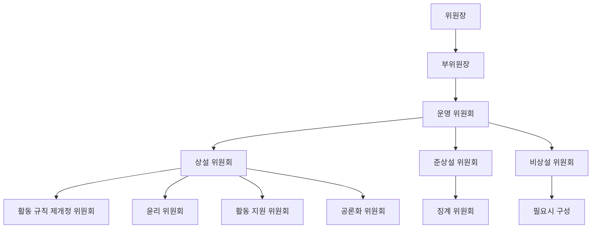
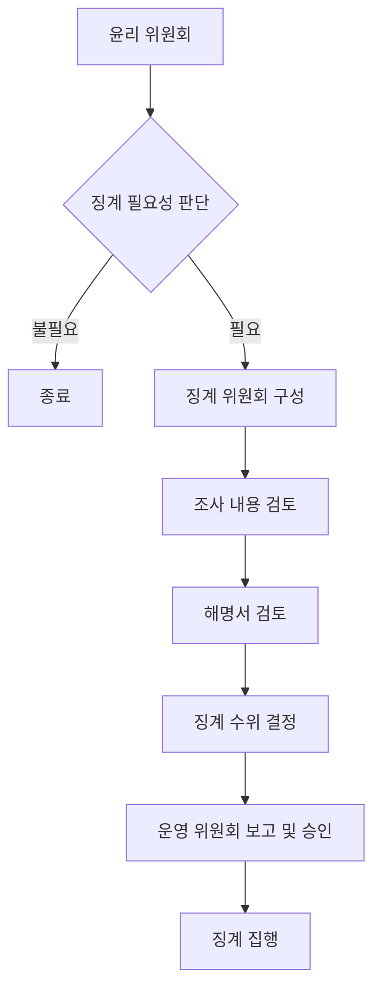
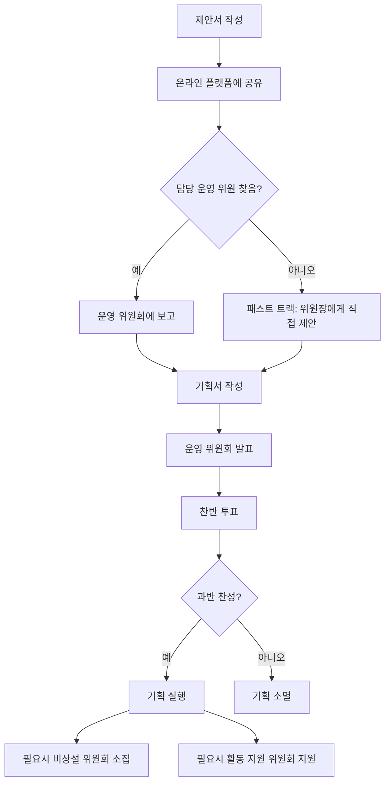
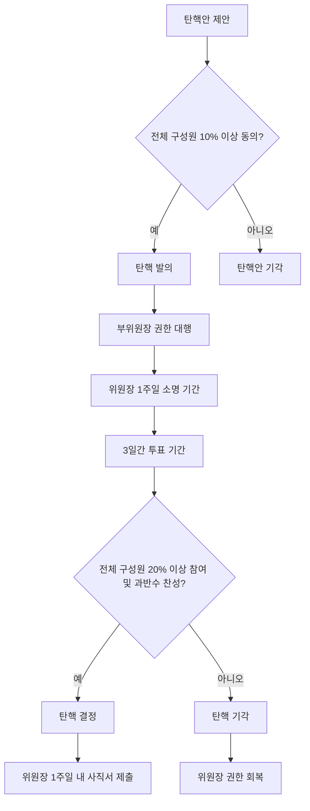
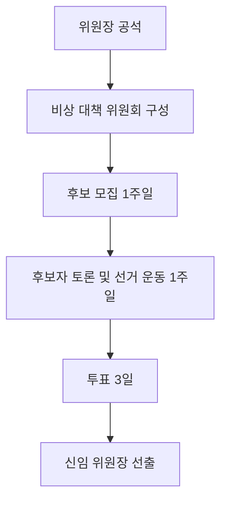
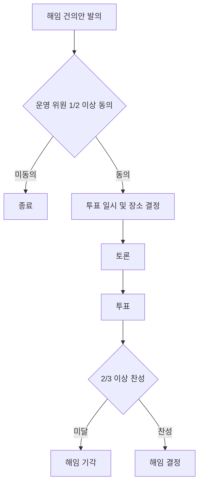

# 민주 서울 네트워크 권리당원협의체 활동 규칙

민주 서울 네트워크 권리당원협의체(이하 민서네)는 더불어민주당의 핵심 가치와 원칙을 지키고, 대한민국의 헌법과 법률을 준수하여 모든 구성원들의 권리를 보호하고, 더 좋은 사회를 만들기 위해 노력한다. 또한 더불어민주당의 첫 권리당원협의체를 넘어서 서울시당의 상임 위원회가 되도록 노력한다.

## 정의

더불어민주당 서울지역 당원들을 대표하여 서울시당의 당무에 **직/간접적으로 참여**하기 위한 **권리당원협의체**이다.

## 목적

당과 당원과의 **활발한 소통**을 통해 **당내 민주주의를 증진**하고 **당원 중심 문화**를 구축하며, 이를 바탕으로 더불어민주당에 대한 이미지를 환기시키고 당의 외연을 확장한다.

## 행동 규칙

1. **투명성**: 우리는 공정하고 투명한 의사결정을 추구하며, 이에 대한 책임과 공정성을 항상 유지합니다. 의사결정 과정은 명확하게 기록하고 공개합니다.
2. **존중과 인권 보호**: 우리는 모든 구성원의 인권을 존중하며, 그들의 다양성과 다름을 인정하고 이를 존중합니다. 성별, 연령, 인종, 종교, 성 정체성, 장애 등을 이유로 한 차별은 절대로 하지 않습니다.
3. **정중하고 상호 존중하는 의사표현**: 우리는 서로의 의견을 존중하고, 강한 감정 표현이나 욕설을 자제합니다. 모든 구성원은 서로를 존중하며, 유익하고 건설적인 대화를 유지하려고 노력합니다.
4. **공동체 의식**: 우리는 서로에 대한 존중과 상호 협력을 통해 강력한 공동체를 구축하려고 노력합니다. 서로의 의견을 존중하고, 협력하며, 함께 성장합니다.
5. **봉사 정신**: 우리는 대한민국의 시민과 더불어민주당을 위해 봉사하며, 공동의 이익을 위해 헌신합니다. 가능한 개인의 이익보다는 공동체의 이익을 우선합니다.
6. **합법적인 행동**: 우리는 모든 활동에서 합법적이고 윤리적인 행동을 추구합니다. 대한민국의 헌법과 법률, 그리고 더불어민주당의 당헌, 당규를 준수하며, 부정행위는 절대로 하지 않습니다.
7. **협업과 융합**: 우리는 중앙당, 서울시당, 그리고 다양한 조직과의 융합을 통해 긍정적인 결과를 위해 노력합니다. 다양한 이해관계자들과의 소통과 협업을 통해 더불어민주당의 가치와 목표를 실현해 나갑니다.
8. **당내 민주주의를 위한 노력**: 우리는 더불어민주당 내에서 민주주의를 위해 적극적으로 참여하고, 투명하고 공정한 당정을 위해 끊임없이 노력합니다.

## 민주 서울 네트워크의 구성

### 위원장
#### 자격
1. 민서네 **전체 구성원의 투표**를 통해 **1인**을 선출한다.
2. 임기는 서울시당 위원장의 임기와 동일하며, 연임을 할 수 없다.

#### 권한
1. 유일하게 전원 투표를 통해 선출된 사람으로 **민주적 정당성**을 가진다.
2. 민서네의 모든 사안에 최종 결정권을 가진다.
3. 민서네의 민주적 운영을 위하여 운영 위원들과 **민주적인 방법**으로 소통하고 의사 결정한다.

#### 책임
1. 민서네의 목적을 달성하기 위해 노력한다.
2. 민서네의 **당내 발언권 향상 및 민서네의 질적/양적 향상**을 위해 힘쓴다.
3. 민서네 전체의 이익을 대변한다.
4. 구성원들의 의견을 수렴하여 민서네를 대표한다.

### 부위원장
#### 자격
1. 위원장이 재량으로 **1인**을 임명한다.
2. 정해진 임기는 없으나 위원장은 재량으로 언제든 부위원장을 **교체**할 수 있다.
3. 위원장의 임기가 종료되면 부위원장의 임기도 함께 종료된다.
4. 같은 위원장 내에서 부위원장의 재임은 불가하다.

#### 권한
1. 위원장으로부터 특정 또는 전체 권한을 위임받아 행사할 수 있다.
2. 부위원장은 위임된 권한을 통해 민서네 운영에 참여한다.
3. 모든 권한의 위임과 철회는 반드시 서면으로 이루어져야 하며, 위임 내용과 기간을 명확히 명시해야 한다.
4. 위원장은 기한이 남아 있는 권한을 언제든 **철회**할 수 있다.

#### 책임
1. 위원장을 **보조하고 협력**하여 민서네의 목표 달성을 위해 노력한다.
2. 위원장으로부터 위임받은 권한을 성실히 수행한다.

#### 특이사항
1. 부위원장은 공석이 될 수 없으며, 부위원장 해임을 공표하는 시점에 **차기 부위원장**도 함께 공표되어야 한다.

### 운영 위원
#### 자격
1. 위원장이 임명하며, 선발 방식은 위원장의 **재량**에 맡기며 연임은 가능하다.
2. 운영 위원은 본인이 원할 때까지 활동할 수 있으나, 위원장의 임기가 종료되면 운영 위원의 임기도 함께 종료된다.
3. 운영 위원의 수는 민서네 전체 인원의 최소 3%, 최대 5%로 유지되어야 하며, 위원장은 이를 관리할 책임이 있다.
4. 운영 위원은 부위원장을 겸임할 수 있다.

#### 권한
1. 민서네 활동에 대한 **의사 결정권**을 갖는다.
2. 활동 기획의 담당자 또는 조력자가 되어 일을 진행한다.
3. 위원장에 대한 탄핵 소추권을 가진다.
4. 부위원장 및 다른 운영 위원에 대한 해임을 건의할 수 있다.

#### 책임
1. 위원장 및 부위원장과 협력하여 민서네를 운영해 나간다.
2. 민서네 의사 결정에 적극 참여해야 한다.
3. 투표 결과에 대해 비밀을 유지해야 한다.

### 민서네 위원

#### 자격
1. 민서네의 모든 구성원은 민서네 위원으로 자동 임명된다.
2. 더불어민주당 **서울지역** 권리당원이어야 한다.
3. 민서네 위원장을 제외한 모든 선출직 및 후보들은 민서네 위원의 자격이 상실된다.

#### 권한
1. 민서네 활동에 대한 기획을 **제안하고 참여**할 수 있다.
2. 위원장 선출 및 민서네 전원 투표에 대한 투표권을 가진다.

#### 책임
1. 민서네의 목적 실현을 위한 활동에 참여한다.
2. 민서네 활동에 대한 기획 제출하고, 승인된 활동에 참여한다.
3. 민서네의 발전을 위해 건설적인 의견을 제시한다.
4. 활동 규칙을 준수한다.

#### 특이사항
1. 민서네 위원의 자격 상실[^1]

## 민주 서울 네트워크의 구조

### 운영 위원회

#### 역할
1. 민서네의 **최고 의사 결정 위원회**로서 기능한다.
2. 모든 주요 안건과 규칙의 제정 및 개정을 승인한다.
3. 일상 운영을 담당하며, 중요한 결정과 정책을 협의하고 결정한다.

#### 구성
1. 위원장, 부위원장, 그리고 모든 운영 위원들은 운영 위원회에 속한다.

#### 회의
1. 지난 회의 이후 **3주 이내에, 한달에 최소 2번** 이상의 회의를 소집해야 한다.
2. 온라인 또는 오프라인 방식으로 자유롭게 진행할 수 있다.
3. 위원장 또는 부위원장이 소집할 수 있다.
4. 위원장 또는 부위원장은 회의 이후 3일 이내에 민서네 전원을 위한 회의 보고서를 작성하여 공개해야 한다.

#### 의결
1. 전체 운영 위원의 절반 이상의 **찬성**으로 의결한다.
2. 투표는 기명으로 진행하나, 개별 위원의 투표 내용은 공개하지 않는다.
3. 반대 의견이 있을 경우, 해당 의견을 정리하여 의결 결과와 함께 반드시 공개해야 한다.

### 상설 위원회

#### 구성
1. 상설 위원회는 운영 위원 및 민서네 위원으로 구성된다.
2. 각 위원회는 **최소 3인 이상**으로 구성되며, 최대 인원의 제한은 없다.
3. 각 위원회는 운영 위원 1인, 민서네 위원 1인 이상을 반드시 포함하여 구성해야 한다.
4. 운영 위원은 최소 1개 이상, 최대 3개까지의 상설 위원회에 참여해야 한다. 다만 위원장과 부위원장은 3개 이상의 상설 위원회에 참여할 수 있다.

#### 역할
1. 상설 위원회의 구성원은 각 위원회의 원활한 운영을 위한 역할을 수행한다.
2. 각 위원회는 그 목적에 맞는 활동을 계획하고 실행한다.

#### 운영
1. 각 위원회는 정기적으로 회의를 개최하고, 활동 결과를 운영 위원회에 보고한다.
2. 위원회의 활동은 민서네의 목적과 방향성에 부합해야 한다.

#### 활동 규칙 제개정 위원회

##### 목적
1. 민서네의 활동 규칙을 **제정하고 개정**하는 역할을 담당한다.

##### 구성
1. 상설 위원회의 일반적인 구성 원칙을 따른다.

##### 역할
1. 활동 규칙의 제정 및 개정안을 작성한다.
2. 제정 및 개정안에 대한 의견 수렴 과정을 진행한다.
3. 최종 제정 및 개정안을 운영 위원회에 상정한다.
4. 활동 규칙 제개정시, **의도 및 해설집**을 제공하여 활동 규칙을 잘 활용할 수 있도록 한다.

##### 특이사항
1. 활동 규칙 개정 시 민서네 전체 구성원의 의견을 수렴하는 절차를 반드시 거쳐야 한다.

#### 윤리 위원회

##### 목적
1. 민서네 구성원들의 윤리적 행동을 감독/교육하고, **징계 필요성**을 판단한다.

##### 구성
1. 민서네 위원장을 윤리 위원회의 장으로 정한다.
2. 그 외 구성원은 상설 위원회의 일반적인 구성 원칙을 따른다.

##### 역할
1. 신고된 사안에 대해 성실히 조사하여 징계 필요성 여부를 판단한다.
2. 징계 필요성 여부는 신고 후 1주 내로 판단해야 한다.
3. 윤리 위원회는 징계의 필요성만을 결정하며, 징계 수위의 결정은 하지 않는다.
4. 징계 필요성 여부는 다음을 기준으로 판단한다:
   a. 민서네, 더불어민주당, 더불어민주당 서울시당의 명예를 훼손한 경우. 다만, 민서네 위원 개인 간에 발생한 명예훼손의 경우는 제외한다.
   b. 민서네의 직위를 남용한 경우
   c. 그 밖에 민서네 자격을 박탈할 만큼 중대한 위반 행위를 한 경우
5. 징계가 필요하다고 결졍된 경우 조상 내용은 징계 당사자에게도 전달되며, 윤리 위원회는 징계 당사자에게 해명서를 요청한다.
6. 조사 내용을 정리하여 운영 위원회에 공유하며, 징계 여부에 따 위원장에게 징계를 담당할 위원회의 구성을 건의한다.

#### 활동 지원 위원회

##### 목적
1. 민서네 위원들의 제안서 작성부터 운영 위원의 기획서 작성 및 실행까지 전 과정을 **지원**한다.

##### 구성
1. 상설 위원회의 일반적인 구성 원칙을 따른다.

##### 역할
1. 제안서 단계 지원
   1. 민서네 위원의 제안서 작성을 지원한다.
   2. 제안에 대한 실행 가능성 등에 대해 조언을 제공한다.
2. 기획서 단계 지원
   1. 운영 위원의 기획서 작성을 지원한다.
   2. 기획에 대한 실행 가능성 등에 대해 조언을 제공한다.
   3. 기획 실행에 필요한 예상 예산을 산정하는 데 도움을 준다.
3. 실행 단계 지원
   1. 장소 섭외 등 실무적 지원을 제공한다.
   2. 서울시당과의 협업이 필요한 경우 카운터파트로 업무를 진행한다.

##### 특이사항
1. 제안서
   1. 민서네 위원 누구나 자유롭게 제출할 수 있다.
   2. 활동에 대한 기본적인 아이디어와 개요를 담고 있다.
   3. 제안서 양식은 간단하며, 활동의 목적, 예상 효과, 필요한 자원 등을 포함한다.
2. 기획서
   1. 1명 이상의 운영 위원이 제출해야 한다.
   2. 제안서를 바탕으로 구체화된 실행 계획을 담고 있다.
   3. 상세한 일정, 필요 인원, 예상 예산, 기대 효과 등을 포함한다.
   4. 운영 위원회의 승인을 받아야 실행될 수 있다.

#### 공론화 위원회

##### 목적
1. 민서네 전체의 의견을 수렴하기 위한 **공론의 장**을 마련하고, 중요 쟁점에 대한 토론을 주관한다.

##### 구성
1. 상설 위원회의 일반적인 구성 원칙을 따른다.

##### 역할
1. 민서네 안팎에서 일어나는 중요 쟁점을 파악하고 공론화 의제를 선정한다.
2. 선정된 의제에 대한 공론화 과정을 설계하고 진행한다.
3. 공론화 과정에서 다양한 의견이 공정하게 표현될 수 있도록 토론을 조율한다.
4. 공론화 결과를 정리하고 운영 위원회에 보고한다.
5. 필요시 외부 전문가를 초청하여 의견을 청취하고 토론에 참여시킨다.

##### 특이사항
1. 모든 민서네 위원은 공론화 위원회에 의제를 제안할 수 있다.
2. 공론화 과정은 온라인 또는 오프라인으로 진행될 수 있으며, 가능한 많은 위원의 참여를 독려한다.
3. 공론화 결과는 구속력은 없지만, 운영 위원회의 의사결정에 중요한 참고자료로 활용된다.

### 준상설 위원회

#### 징계 위원회

##### 목적
1. **징계의 수위를 결정**하기 위하여 필요시에만 존재하는 준상설 위원회이다.
##### 구성
1. 윤리 위원회에서 징계의 필요성을 판단하고 위원장에게 요청하면, 위원장은 3일 이내에 징계 위원회 소집 공고를 내야 한다.
2. 소집 공고 후 3일간 참여 희망 위원을 모집하여 징계 위원회를 구성한다.
3. 구성원 수는 민서네 전체 인원의 3% 이상으로 한다.
4. 공정성을 위해 윤리 위원회 위원은 제외한다.
5. 해당 사안의 처리가 완료되면 자동으로 해산된다.
##### 역할
1. 윤리 위원회가 제출한 징계 필요성 판단 및 조사 내용을 검토한다.
2. 징계 당사자의 해명서를 검토한다.
3. 해당 사안에 대한 징계 수위를 결정한다. 필요시 징계를 내리지 않을 수도 있다.
4. 결정된 징계 내용을 운영 위원회에 보고한다.
##### 운영
1. 징계 위원회는 구성 완료 즉시 활동을 시작하며, 1주일 이내에 결론을 도출한다.
2. 윤리 위원회의 조사 내용과 징계 당사자의 해명서를 근거로 판단한다.
3. 징계 당사자가 해명서를 제출하지 않을 경우, 해당 혐의를 인정한 것으로 간주한다.
4. 징계 위원회의 결정은 운영 위원회에 보고되며, 운영 위원회의 최종 승인 후 징계가 집행된다.

##### 특이사항
1. 운영 위원회의 최종 승인 전, 당사자는 운영 위원회에 참석하여 항변할 기회를 가질 수 있다. 운영 위원회는 징계 위원회의 결정을 존중하나, 필요시 징계 수위를 조정할 수 있다.

### 비상설 위원회

#### 목적
1. 특정 사안이나 프로젝트를 위해 임시로 구성되어 운영되는 위원회이다.

#### 구성
1. 위원장의 필요에 따라 구성된다.
2. 구성원 수와 자격은 해당 위원회의 목적에 따라 위원장이 결정한다.
3. 위원회의 존속 기간에 제한을 두지 않으며, 위원장의 판단에 따라 언제든지 해산할 수 있다.

#### 역할
1. 특정 사안이나 프로젝트에 대해 집중적으로 활동한다.
2. 활동 결과를 정기적으로 운영 위원회에 보고한다.
3. 위원장 요청 시 최종 결과를 정리하여 운영 위원회에 제출한다.

#### 운영
1. 각 비상설 위원회는 그 목적에 맞춰 유연하게 운영된다.

## 활동 제안과 실행

### 제안 절차

1. 민서네 구성은 누구나 활동 기획을 **제안**할 수 있다.
2. 제안은 **제안서**라는 간단한 양식을 통해 작성한다.
3. 제안서 작성 시 어려움이 있는 경우, 활동 지원 위원회에 도움을 요청할 수 있다.
4. 완성된 제안서는 지정된 온라인 플랫폼[^4]에 공유한다.

### 담당 운영 위원 선정

1. 제안자는 온라인 플랫폼[^4]을 통해 자신의 제안 내용을 알리고, 책임지고 진행할 운영 위원을 직접 찾아야 한다.
2. 담당 운영 위원이 결정되면, 제안서가 게시된 온라인 플랫폼[^4]의 댓글 등을 통해 공지해야 한다.

### 운영 위원의 역할

1. 담당 운영 위원은 운영 위원회에 해당 제안 책임을 맡게 된 것을 공지해야 한다.
2. 운영 위원은 더 구체적인 **기획서**를 제안자와 심도깊은 논의를 통해 구체적으로 작성해야 한다.
3. 기획서 작성 시 공론화 위원회에 토론을 제안하거나 활동 지원 위원회에 절차 등을 문의할 수 있다.

### 기획안 승인 절차

1. 작성된 기획안은 운영 위원회에서 찬반 투표 전에 발표한다.
2. 발표 후 반대 의견을 청취한다.
3. 찬반 투표를 실시한다.
4. 찬성이 많으면 기획을 계획대로 진행하고, 반대가 많으면 기획은 소멸된다.
5. 기획이 무산될 경우, 반대 의견을 기록하여 전체 공지해야 한다. 이 때 누구의 의견인지는 무기명으로 한다.

### 승인된 기획의 실행

1. 필요한 경우 위원장에게 비상설 위원회 소집을 요청할 수 있다.
2. 필요한 경우 활동 지원 위원회에 도움을 요청할 수 있다.

### 패스트 트랙 제안

1. 민서네 위원이 담당 운영 위원을 찾지 못한 경우, 위원장에게 직접 제안할 수 있다.
2. 위원장은 제안 내용을 검토 후 진행 여부를 결정한다.
3. 진행 결정 시 위원장이 담당 운영 위원을 지정한다.

### 패스트 트랙 운영 위원 선정 방식

1. 운영 위원 선발 시 임의의 방식으로 **순번**을 미리 정한다.
2. 패스트 트랙 제안/기획 업무는 이 순번대로 배정한다.
3. 하나의 제안/기획 업무를 처리하면 해당 운영 위원은 자동으로 순번의 가장 뒤로 이동한다.

### 운영 위원의 의무

1. 운영 위원은 자신이 맡은 제안/기획 업무가 최대한 승인되도록 노력할 의무가 있다.

### 제안서 및 기획서 양식

1. 제안서 양식[^2]
2. 기획서 양식[^3]

## 대외 활동

### 정의
1. 민서네 일동 명의의 문서를 생성하거나 민서네를 대표하는 활동을 하는 경우를 대외 활동으로 정의한다.

### 승인 절차
1. 대외 활동을 위해서는 기존 활동의 제안과 실행 절차 외에 민서네 전체 위원들의 투표가 필요하다.
2. 투표는 민서네의 공식 온라인 플랫폼을 통해 진행한다.
3. 투표 기간은 위원장의 재량에 따른다.

### 승인 기준
1. 민서네 전체 위원 수의 절반 이상이 찬성해야 승인된 것으로 간주한다.
2. 투표 참여율이 전체 위원의 30% 미만인 경우, 해당 투표는 무효로 처리한다.

### 긴급 상황 대응
1. 긴급한 대외 활동이 필요한 경우, 위원장은 운영 위원회의 동의를 얻어 임시 성명서 발표나 활동을 할 수 있다.

## 위원장의 탄핵 및 사임

### 탄핵 사유
1. **심각한 명예훼손**: 민서네의 명예를 훼손하는 발언이나 행위를 한 경우
2. **직무 유기**: 합리적 사유 없이 회의를 지속적으로 연기하거나 불참하는 경우, 또는 회의록을 작성하지 않는 경우
3. **정보관리 소홀**: 민서네 구성원의 정보를 부주의하게 관리하여 유출하는 경우

### 탄핵 절차
1. 탄핵 제안 및 발의
   1. 탄핵안 제안은 민서네의 공식 온라인 플랫폼[^4]을 통해 누구나 할 수 있으나 전체 구성원의 **10% 이상이 동의**하면 자동 발의된다.
   2. 탄핵이 발의되면, 부위원장이 권한을 대행하며 위원장의 모든 권한을 자동으로 위임받는다.
2. 발의 후 절차
   1. 탄핵 발의 후 1주일 동안 위원장은 소명 기회를 가진다.
   2. 소명 이후 3일 동안 투표기간을 가진다.
3. 탄핵 결정
   1. 전체 구원의 **20% 이상이 투표에 참여하고, 투표 참여 인원의 과반수 이상 찬성**으로 탄핵이 가결된다.
   1. 탄핵이 가결되면 위원장은 1주일 내에 사직서를 서울시당에 제출해야 한다.
4. 탄핵 기각
   1. 탄핵이 기각된 경우, 기존 위원장이 부위원장으로부터 권한을 다시 획득한다.

### 사임
위원장이 스스로 직무를 수행할 수 없다고 판단할 경우, 부위원장에게 권한을 위임하고 사임하여 위원장직을 공석으로 만들 수 있다.

### 신임 위원장 선출
1. 위원장직이 공석이 되면, 운영 위원회는 **비상 대책 위원회** 로 변경되며, 기존의 부위원장은 **비상 대책 위원장**이 되고 운영 위원들은 유임된다.
2. 비상 대책 위원회는 새로운 위원장 선출을 위한 선거를 준비하고 관리하기 위한 조직으로, 선거 외의 다른 새로운 기획을 추진할 수 없으며, 현재 진행되고 있는 기획들이 성공할 수 있도록 운영할 책임이 있다.
3. 신임 위원장 선거는 가능한 민주당 중앙당 시스템을 사용하는 것을 권장하나, 불가피할시 민서네 공식 플랫폼[^4]을 활용한다.
4. **비상 대책 위원회**가 구성되면, 새로운 위원장 후보 모집 1주일, 후보자 토론 및 선거 운동 1주일, 그리고 3일간의 투표를 거쳐 새로운 위원장을 선출한다.
5. 만약, 비상 대책 위원장이 위원장 선거에 출마하려면, 현 운영 위원중 1인에게 **비상 대책 위원장**직을 양보해야 한다.

## 부위원장 및 운영 위원 해임

### 해임 건의 절차
1. 해임 건의안 발의
   1.  운영 위원 누구나 부위원장 또는 다른 운영 위원에 대한 해임 건의안을 발의할 수 있다.
   2. 만약 부위원장과 운영 위원을 겸임하는 경우, 각 직책마다 해임 건의안을 제출해야 한다.
   3. 해임 건의안은 **전체 운영 위원의 과반 이상의 동의**를 받아야 발의된다.
   4. 발의가 되어도 해당 운영위원의 권한이 정지되지 않는다.
2. 투표 일시 및 장소 결정
   1. 해임 건의안이 발의되면, 위원장이 투표의 일시와 장소를 정한다.
3. 투표권 위임
   1. 투표권을 가진 운영 위원이 해당 투표에 참석할 수 없는 경우, 자신의 투표권을 위원장에게 위임할 수 있다.
   2. 투표권 위임은 **위임장**을 통해 명시적으로 이루어져야 한다.
4. 토론 및 투표
   1. 지정된 일시와 장소에서 해임에 대한 토론을 거친 후 최종 투표를 진행한다.
   2. 투표 참여 인원의 ⅔ 이상이 찬성하면 부위원장 또는 해당 운영 위원을 해임할 수 있다.
5. 해임 결정
   1. 해임이 결정되면 위원장은 1주일 내에 사직서를 서울시당에 제출해야 한다 .

### 자동 자격 박탈
1. 회의 불참
   1. 정기 운영 회의와 위원장이 소집한 중요 안건에 대한 회의에 **3회 이상 미참여** 시 운영 위원 자격이 자동으로 박탈된다.

[^1]: 민서네 위원의 자격 상실 항목 필요
[^2]: 제안서 양식 제공 필요
[^3]: 기획서 양식 제공 필요
[^4]: 온라인 플랫폼 항목 필요
