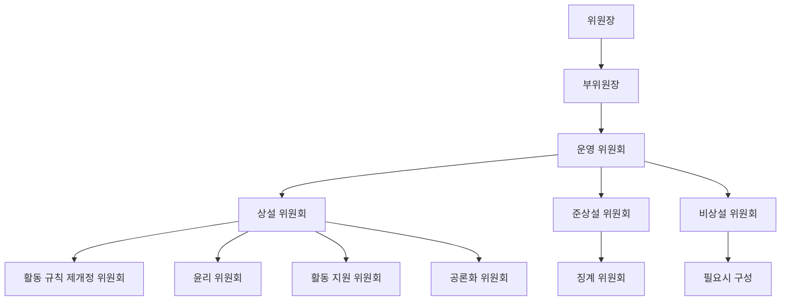
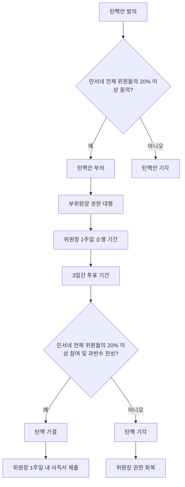
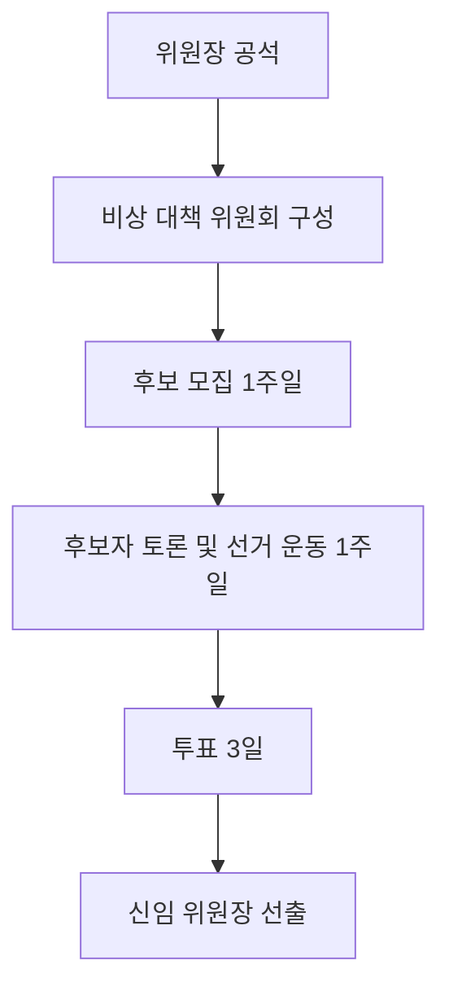
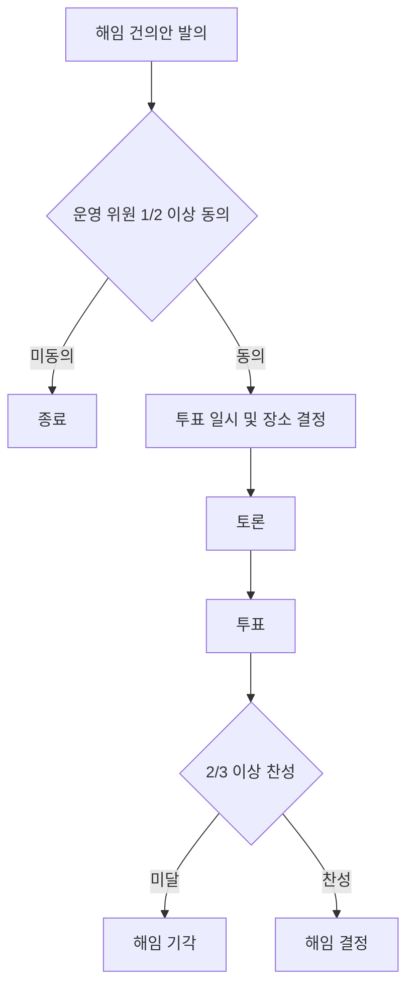

# 민주 서울 네트워크 권리당원협의체 활동 규칙

민주 서울 네트워크 권리당원협의체(이하 민서네)는 더불어민주당의 핵심 가치와 원칙을 지키고, 대한민국의 헌법과 법률을 준수하여 모든 구성원들의 권리를 보호하고, 더 좋은 사회를 만들기 위해 노력한다. 또한 더불어민주당의 첫 권리당원협의체를 넘어서 서울시당의 상임 위원회가 되도록 노력한다.

## 정의

더불어민주당 서울지역 당원들을 대표하여 서울시당의 당무에 `직/간접적으로 참여`하기 위한 `권리당원협의체`이다.

## 목적

당과 당원과의 `활발한 소통`을 통해 `당내 민주주의를 증진`하고 `당원 중심 문화`를 구축하며, 이를 바탕으로 더불어민주당에 대한 이미지를 환기시키고 당의 외연을 확장한다.

## 행동 규칙

1. `투명성`: 우리는 공정하고 투명한 의사결정을 추구하며, 이에 대한 책임과 공정성을 항상 유지합니다. 의사결정 과정은 명확하게 기록하고 공개합니다.
2. `존중과 인권 보호`: 우리는 모든 구성원의 인권을 존중하며, 그들의 다양성과 다름을 인정하고 이를 존중합니다. 성별, 연령, 인종, 종교, 성 정체성, 장애 등을 이유로 한 차별은 절대로 하지 않습니다.
3. `정중하고 상호 존중하는 의사표현`: 우리는 서로의 의견을 존중하고, 강한 감정 표현이나 욕설을 자제합니다. 모든 구성원은 서로를 존중하며, 유익하고 건설적인 대화를 유지하려고 노력합니다.
4. `공동체 의식`: 우리는 서로에 대한 존중과 상호 협력을 통해 강력한 공동체를 구축하려고 노력합니다. 서로의 의견을 존중하고, 협력하며, 함께 성장합니다.
5. `봉사 정신`: 우리는 대한민국의 시민과 더불어민주당을 위해 봉사하며, 공동의 이익을 위해 헌신합니다. 가능한 개인의 이익보다는 공동체의 이익을 우선합니다.
6. `합법적인 행동`: 우리는 모든 활동에서 합법적이고 윤리적인 행동을 추구합니다. 대한민국의 헌법과 법률, 그리고 더불어민주당의 당헌, 당규를 준수하며, 부정행위는 절대로 하지 않습니다.
7. `협업과 융합`: 우리는 중앙당, 서울시당, 그리고 다양한 조직과의 융합을 통해 긍정적인 결과를 위해 노력합니다. 다양한 이해관계자들과의 소통과 협업을 통해 더불어민주당의 가치와 목표를 실현해 나갑니다.
8. `당내 민주주의를 위한 노력`: 우리는 더불어민주당 내에서 민주주의를 위해 적극적으로 참여하고, 투명하고 공정한 당정을 위해 끊임없이 노력합니다.

## 민주 서울 네트워크의 구성

### 위원장

#### 자격

1. 민서네 전체 위원들의 민주적 의사 결정 과정을 통해 선출되는 `단일 대표자`이다.
2. 임기는 서울시당 위원장의 재임 기간과 일치하며, 연임은 허용되지 않는다.

#### 권한

1. 민서네 전체 위원들의 직접 투표로 선출된 유일한 인물로서 `민주적 정당성`을 부여받는다.
2. 민서네의 모든 사안에 대해 최종적인 결정권을 행사한다.
3. 민서네의 민주적 운영을 위해 운영 위원들과 `협력하고 민주적인 방식으로 소통하며 의사 결정`한다.

#### 책임

1. 민서네 전체 위원들을 대표한다.
2. 민서네의 목적 달성을 위해 노력한다.
3. 민서네의 `당내 영향력 강화 및 질적/양적으로 성장`시킨다.
4. 민서네 전체의 이익을 대변하고, 민서네 전체 위원들의 의견을 경청하고 존중한다.

### 부위원장

#### 자격

1. 위원장은 자신을 보조해줄 `1인`을 부위원장으로 선임해야 하며, 선발 방식은 위원장의 재량에 맡긴다.
2. 특정 임기는 정해져 있지 않으나, 위원장의 판단에 따라 언제든 `교체`될 수 있다.
3. 위원장의 임기 종료와 동시에 부위원장의 임기도 자동 종료된다.
4. 동일 위원장 하에서 부위원장의 재임은 불가하다.

#### 권한

1. 위원장으로부터 특정 또는 전체 권한을 위임받아 행사할 수 있다.
2. 위임된 권한을 바탕으로 민서네의 운영에 참여한다.
3. 모든 권한의 위임과 철회는 반드시 서면으로 이루어져야 하며, 위임의 범위와 기간을 명확히 명시해야 한다.
4. 위원장은 기한이 남아 있는 권한이라도 필요시 즉시 `철회`할 수 있다.

#### 책임

1. 위원장을 `보조하고 협력`하여 민서네의 목표 달성을 위해 노력한다.
2. 위원장으로부터 위임받은 권한을 성실히 수행한다.

#### 특이사항

1. 부위원장직은 공석으로 남겨둘 수 없으며, 부위원장 해임을 공표하는 시점에 반드시 후임자도 함께 공지되어야 한다.

### 운영 위원

#### 자격

1. 위원장이 임명하며, 선발 방식은 위원장의 `재량`에 맡긴다.
2. 운영 위원은 자발적 의사에 따라 활동 기간을 결정할 수 있으나, 위원장의 임기 종료와 함께 그 직위도 자동 종료된다.
3. 운영 위원의 인원은 민서네 전체 구성원의 최소 3%, 최대 5% 범위 내에서 유지되어야 하며, 이에 대한 관리 책임은 위원장에게 있다.
4. 운영 위원은 부위원장직을 겸임할 수 있다.
5. 운영 위원은 연임이 가능하다.

#### 권한

1. 활동 기획의 담당자 또는 협력자가 되어 업무를 수행한다.
2. 민서네 활동에 대한 `의사 결정권`을 가진다.
3. 위원장에 대한 `탄핵 발의권`을 가진다.
4. 부위원장 및 다른 운영 위원에 대한 `해임 건의권`을 가진다.

#### 책임

1. 위원장 및 부위원장과 협력하여 민서네의 운영을 담당한다.
2. 민서네 의사 결정에 적극 참여해야 한다.
3. 투표 결과에 대해 기밀 유지 의무를 준수해야 한다.

### 민서네 위원

#### 자격

1. 민서네에 소속된 모든 구성원은 자동적으로 민서네 위원의 자격을 획득한다.
2. 더불어민주당 `서울지역` 권리당원이어야 한다.
3. 민서네 위원장을 제외한 `모든 선출직 및 후보자들은 민서네 위원의 자격이 상실된다`.

#### 권한

1. 민서네 활동에 대한 기획을 `제안하고 참여`할 수 있다.
2. `위원장 선출 및 민서네 전원 투표에 대한 투표권`을 가진다.

#### 책임

1. 민서네의 목적 실현을 위한 다양한 활동에 적극적으로 참여한다.
2. 민서네의 발전을 위해 건설적인 의견을 제시한다.
3. 제정된 활동 규칙을 엄격히 준수한다.

#### 특이사항

1. 민서네 위원의 자격 상실[^1]

## 민주 서울 네트워크의 구조

1. 민서네는 위원장, 부위원장, 운영 위원과 민서네 위원들로 구성된 복수의 위원회를 통하여 운영된다.

### 운영 위원회

#### 역할

1. 민서네의 `최고 의사 결정 기구로서`로서 중추적 기능을 수행한다.
2. 모든 주요 안건과 규칙의 제정 및 개정을 승인한다.
3. 일상적 운영을 총괄하며, 주요 정책과 결정사항을 심도 있게 협의하고 결정한다.

#### 구성

1. 위원장, 부위원장, 그리고 모든 운영 위원들이 운영 위원회의 구성원으로 참여한다.

#### 회의

1. 최근 회의 이후 `3주 이내에, 월 최소 2번` 이상의 회의를 소집해야 한다.
2. 온라인 또는 오프라인 방식으로 탄력적으로 선택하여 진행할 수 있다.
3. 위원장 또는 부위원장이 소집할 수 있고, 최소 3일 전에 안건 및 일정을 사전 공유해야 한다.
4. 위원장 또는 부위원장은 회의 종료 후 3일 이내에 민서네 전원을 위한 상세한 회의 보고서를 작성하여 투명하게 공개해야 한다.

#### 의결

1. 위원장과 부위원장 그리고 전체 운영 위원 과반수 이상의`찬성`으로 의결한다.
2. 투표는 기명 방식으로 진행하되, 개별 위원의 구체적인 투표 내용은 비공개로 한다.
3. 반대 의견이 제시된 경우, 해당 의견을 체계적으로 정리하여 의결 결과와 함께 반드시 공개해야 한다.

### 상설 위원회

#### 역할

1. 민서네 위원들의 자치 활동을 지원하기 위해 상시적으로 운영되는 전문 위원회들이다.
2. 각 상설 위원회의 세부 사항은 `민주 서울 네트워크 위원회` 문서에 상세히 명시한다.

#### 구성

1. 상설 위원회는 운영 위원 및 민서네 위원으로 구성하여 전문성과 다양성을 확보한다.
2. 각 위원회는 `최소 3인 이상`으로 구성되며, 최대 인원에 대한 제한은 두지 않는다.
3. 각 위원회는 반드시 1인 이상의 운영 위원을 포함하여 구성함으로써 운영의 연속성과 전문성을 보장한다.
4. 운영 위원은 최소 1개에서 최대 3개까지의 상설 위원회에 참여해야 한다. 단, 위원장과 부위원장은 3개 이상의 상설 위원회에 참여할 수 있다.

#### 역할

1. 상설 위원회의 위원들은 각 위원회의 원활한 운영을 위해 전문적이고 헌신적인 역할을 수행한다.
2. 각 위원회는 그 고유의 목적에 부합하는 활동을 체계적으로 계획하고 효과적으로 실행한다.

#### 운영

1. 각 위원회는 정기적으로 회의를 개최하고, 그 활동 결과를 상세히 정리하여 운영 위원회에 보고한다.
2. 위원회의 모든 활동은 민서네의 목적과 방향성에 부합해야 한다.

### 준상설 위원회

#### 역할

1. 민서네 위원들의 자치 활동을 지원하되, 반복적으로 발생하는 특정 사안이나 시기에만 필요한 전문 위원회이다.
2. 각 준상설 위원회의 세부 사항은 `민주 서울 네트워크 위원회` 문서에 상세히 명시한다.

### 비상설 위원회

#### 역할

1. 특정 사안이나 활동을 위해 한시적으로 구성되어 운영되는 전문 위원회이다.

#### 구성

1. 위원장의 판단과 필요에 따라 유연하게 구성된다.
2. 구성원의 수와 자격 요건은 해당 위원회의 목적과 성격에 따라 위원장이 결정한다.
3. 위원회의 존속 기간에 대한 명확한 제한은 두지 않으며, 위원장의 판단에 따라 언제든지 해산할 수 있다.

#### 역할

1. 위원회 개설 목적에 맞는 활동에 집중한다.
2. 활동의 진행 상황과 결과를 정기적으로 운영 위원회에 상세히 보고한다.
3. 위원장의 요청이 있을 경우, 최종 또는 중간 결과를 체계적으로 정리하여 운영 위원회에 제출한다.

#### 운영

1. 각 비상설 위원회는 그 고유한 목적에 최적화된 방식으로 유연하고 효율적으로 운영한다.

## 활동 제안과 실행

### 제안 절차

1. 민서네 구성원은 누구나 활동 기획을 `제안`할 수 있다.
2. 제안은 `제안서`[^2]라는 간단한 양식을 통해 작성한다.
3. 제안서 작성 시 어려움이 있는 경우, 활동 지원 위원회에 전문적인 조언과 지원을 요청할 수 있다.
4. 완성된 제안서는 지정된 온라인 플랫폼[^4]을 통해 공유되어야 한다.

### 담당 운영 위원 선정

1. 제안자는 온라인 플랫폼[^4]을 통해 자신의 제안 내용을 알리고, 해당 제안을 책임감 있게 주도할 운영 위원을 직접 찾아야 한다.
2. 담당 운영 위원이 확정되면, 제안서가 게시된 온라인 플랫폼[^4]의 댓글 등을 통해 이를 공지해야 한다.

### 운영 위원의 역할

1. 담당 운영 위원은 해당 제안에 대한 책임을 맡게 된 사실을 운영 위원회에 보고해야 한다.
2. 운영 위원은 제안자와의 심도 있는 논의를 통해 보다 구체적이고 실행 가능한 `기획서`[^3]를 작성해야 한다.
3. 기획서 작성 단계에서 공론화 위원회에 토론을 제안하거나 활동 지원 위원회에 절차적 자문을 구할 수 있다.

### 기획안 승인 절차

1. 완성된 기획안은 운영 위원회에서의 찬반 투표에 앞서 발표를 통해 활동의 목적 및 예상 성과등을 공유해야 한다.
2. 발표 이후 반대 의견에 대한 충분한 청취 과정을 거친다.
3. 활동 제안자는 활동 담장 위원을 지원하기 위하여 운영 위원회에 참여 할 수 있다.
4. 과반수의 찬성을 얻은 기획은 계획대로 진행되며, 그렇지 않은 경우 해당 기획은 폐기된다.
5. 기획이 무산될 경우, 반대 의견을 체계적으로 정리하여 전체 구성원에게 공지해야 한다. 이때 의견 제시자의 익명성은 엄격히 보장된다.

### 승인된 기획의 실행

1. 필요시 위원장에게 비상설 위원회 소집을 공식적으로 요청할 수 있다.
2. 활동 지원 위원회에 전문적인 지원과 조언을 요청할 수 있다.

### 패스트 트랙 제안

1. 민서네 위원이 담당 운영 위원을 찾지 못한 경우, 위원장에게 직접 제안할 수 있다.
2. 위원장은 제안 내용을 검토 후 진행 여부를 결정한다.
3. 진행이 결정된 경우, 위원장의 재량으로 적합한 담당 운영 위원을 지정할 수 있다.

### 패스트 트랙 운영 위원 선정 방식

1. 운영 위원 선발 시 위원장이 선정한 임의의 방식으로 `순번`을 미리 정한다.
2. 패스트 트랙을 통해 제안된 기획 업무는 이 순번에 따라 배정된다.
3. 하나의 제안/기획 업무를 맡게되면 운영 위원은 자동으로 순번의 마지막으로 이동하여 형평성을 유지한다.

### 운영 위원의 의무

1. 운영 위원은 자신이 맡은 제안/기획 업무가 승인 처리 될 수 있도록 전문성과 열정을 바탕으로 최선을 다 해야 한다.
2. 운영 위원은 자신이 맡은 제안/기획 업무가 성공적으로 완료될 수 있도록 전문성과 열정을 바탕으로 최선을 다 해야 한다.

## 대외 활동

### 정의

1. 민서네의 공식 명의로 문서를 발행하거나 민서네를 대표하여 수행하는 모든 활동을 대외 활동으로 규정한다.

### 승인 절차

1. 대외 활동 역시 기존의 활동 제안 및 실행 절차를 따른다.
2. 추가로, 기획서 작성 단계에서 반드시 공론화 위원회를 통해 민서네 구성원들의 다양한 의견을 수렴하고 이를 반영해야 한다.
3. 추가로, 운영 위원회에서 가결된 대외 활동 안건은 최종적으로 민서네 전체 위원들의 투표를 거쳐 결정한다.
4. 민서네 전체 위원들의 투표는 민서네의 공식 온라인 플랫폼을 통해 진행한다.
5. 민서네 전체 위원들의 투표 기간은 원칙적으로 3일로 설정하나, 위원장의 판단에 따라 탄력적으로 조정할 수 있다.

### 승인 기준

1. 대외 활동의 승인은 민서네 전체 위원들의 `30% 이상이 투표에 참여하고, 투표 참여 인원의 과반수 이상의 찬성`을 얻어야 최종 결정된다.
2. 투표 참여율이 전체 구성원의 30% 미만인 경우, 해당 투표는 무효로 처리되어 의사결정의 정당성을 확보한다.

### 긴급 상황 대응

1. 신속한 대외 활동이 요구되는 긴급 상황에서는 위원장이 운영 위원회의 동의를 얻어 임시 성명서를 발표하거나 긴급 활동을 수행할 수 있다.
2. 이 경우, 공론화 위원회와 민서네 전체 위원들의 투표도 생략할 수 있다.

## 위원장의 탄핵 및 사임

### 탄핵 사유

1. `중대한 명예훼손`: 민서네의 공적 이미지와 신뢰도를 현저히 저해하는 언행을 한 경우
2. `직무 유기`: 합당한 사유 없이 회의를 지속적으로 연기하거나 불참하는 행위, 또는 회의록 작성을 소홀히 하는 등 직무를 성실히 수행하지 않는 경우
3. `정보관리 부실`: 민서네 전체 위원들의 개인정보를 부주의하게 관리하여 유출 사고를 초래한 경우ㄹ

### 탄핵 절차

#### 탄핵 제안 및 발의

1. 탄핵안 발의은 민서네의 공식 온라인 플랫폼[^4]을 통해 운영 위원이 할 수 있으나 민서네 전체 위원들의 `20% 이상이 동의`하면 자동 부의된다.
2. 탄핵안이 정식으로 부의되는 즉시, 부위원장에게 위원장의 모든 권한이 자동 위임된다.

#### 발의 후 절차

1. 탄핵 부의 후 1주일 동안 위원장에게 소명 기회가 주어진다.
2. 소명 기간 종료 후, 3일간 민서네 전체 위원들의 투표 기간을 가진다.

#### 탄핵 결정

1. 민서네 전체 위원들의 `30% 이상이 투표에 참여하고, 투표 참여 인원의 과반수 이상 찬성`으로 탄핵이 가결된다.
2. 탄핵이 가결되면 위원장직은 공석이 된다.
3. 탄핵된 위원장은 1주일 이내에 서울시당에 공식적으로 사직서를 제출해야 한다.

#### 탄핵 기각

1. 탄핵이 기각된 경우, 위원장은 부위원장으로부터 위임받은 모든 권한을 즉시 회복한다.

### 사임

1. 위원장이 개인적 사유나 불가항력적 상황으로 인해 직무 수행이 불가능하다고 판단할 경우, 부위원장에게 모든 권한을 위임하고 사임하여 위원장직을 공석으로 만들 수 있다.

### 신임 위원장 선출

1. 위원장직이 공석이 되면, 운영 위원회는 `비상 대책 위원회` 로 전환되며, 기존의 부위원장은 `비상 대책 위원장`으로 임명되고 운영 위원들은 그 직위를 유지한다.
2. 비상 대책 위원회는 새로운 위원장 선출을 위한 선거를 준비하고 관리하는 임시 기구로, 선거 외의 다른 새로운 기획을 추진할 수 없으며, 현재 진행중인 활동등이 원활히 수행될 수 있도록 관리할 책임이 있다.
3. 신임 위원장 선거는 더불어민주당 중앙당 시스템을 활용하는 것을 원칙으로 하나, 불가피한 경우 민서네 공식 플랫폼[^4]을 대안으로 활용할 수 있다.
4. `비상 대책 위원회` 구성 즉시, 1주일간의 신임 위원장 후보 모집 기간, 이어서 1주일간의 후보자 토론 및 선거 운동 기간, 그리고 3일간의 투표 기간을 거쳐 신임 위원장을 선출한다.
5. 만약 비상 대책 위원장이 위원장 선거에 출마하고자 할 경우, 현 운영 위원 중 1인에게 비상 대책 위원장직을 이양해야 한다.

## 부위원장 및 운영 위원 해임

### 해임 건의 절차

#### 해임 건의안 발의

1. 위원장, 부위원장, 운영 위원은 타 부위원장 또는 운영 위원에 대한 해임 건의안을 발의할 수 있다.
2. 부위원장과 운영 위원을 겸직하는 경우, 각 직책에 대해 개별적으로 해임 건의안을 발의해야 한다.
3. 해임 건의안은 `전체 운영 위원들의 과반 이상의 동의`를 받아야 부의된다.
4. 해임 건의안이 부의되더라도 해당 운영 위원의 직무 수행 권한은 즉시 정지되지 않는다.

#### 투표 일시 및 장소 결정

1. 해임 건의안이 부의되면, 위원장이 즉시 일시와 장소를 정한다.
2. 투표는 부의 이후 일주일 이내에 실행되어야 한다.
3. 투표는 온라인 및 오프라인 모두 가능하다.

#### 투표권 위임

1. 투표권을 가진 운영 위원이 해당 투표에 참석할 수 없는 경우, 자신의 투표권을 위원장에게 위임할 수 있다.
2. 투표권 위임은 `위임장`을 통해 명시적으로 이루어져야 한다.

#### 토론 및 투표

1. 지정된 일시와 장소에서 해임에 대한 토론을 거친 후 최종 투표를 진행한다.
2. 투표 참여 인원의 ⅔ 이상이 찬성할 경우, 해당 부위원장 또는 운영 위원은 즉시 해임되고 권한이 사라진다.

#### 해임 결정

1. 해임이 최종 결정되면 해당 부위원장 또는 운영 위원은 일주일 이내에 사직서를 서울시당에 제출해야 한다.

### 사임

1. 사임을 원하는 부위원장 또는 운영 위원은 위원장에서 우선 사임 의사를 밝혀야 한다.
2. 위원장은 운영 위원과 사임 시기를 상의하여 사임 일시를 정하고 온라인 플랫폼[^4]에 공지한다.
3. 사임하는 운영 위원은 사임 일시에 맞춰서 서울시당에 사직서를 제출한다.

### 자동 자격 박탈

1. 회의 불참: 정기 운영 회의와 위원장이 소집한 중요 안건에 대한 회의에 `최근 5회중 3회 불참시` 운영 위원 자격이 자동으로 박탈된다.

[^1]: 민서네 위원의 자격 상실 항목 필요

[^2]: 제안서 양식 제공 필요

[^3]: 기획서 양식 제공 필요

[^4]: 온라인 플랫폼 항목 필요
